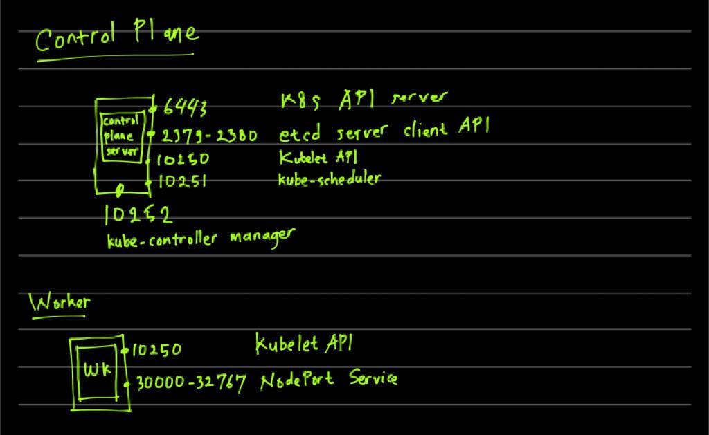
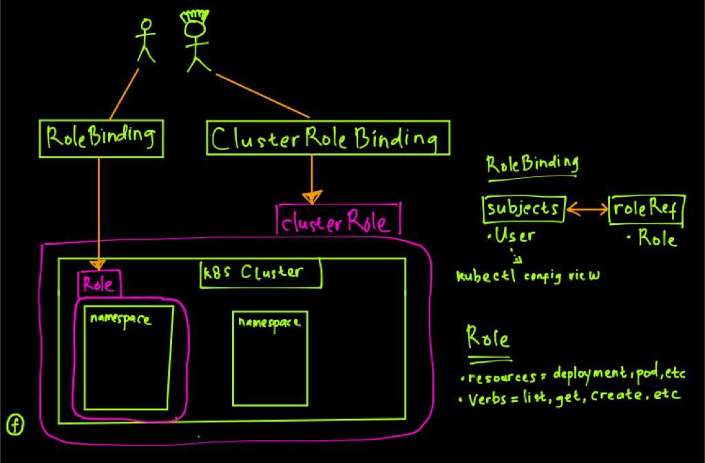
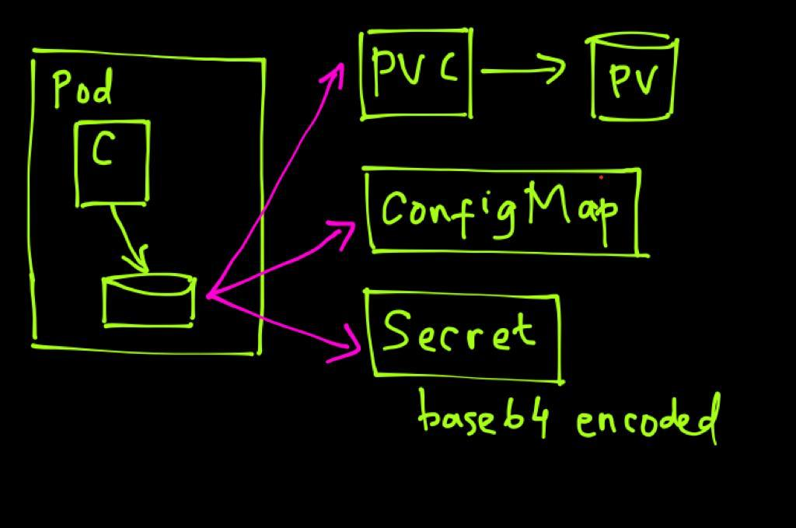
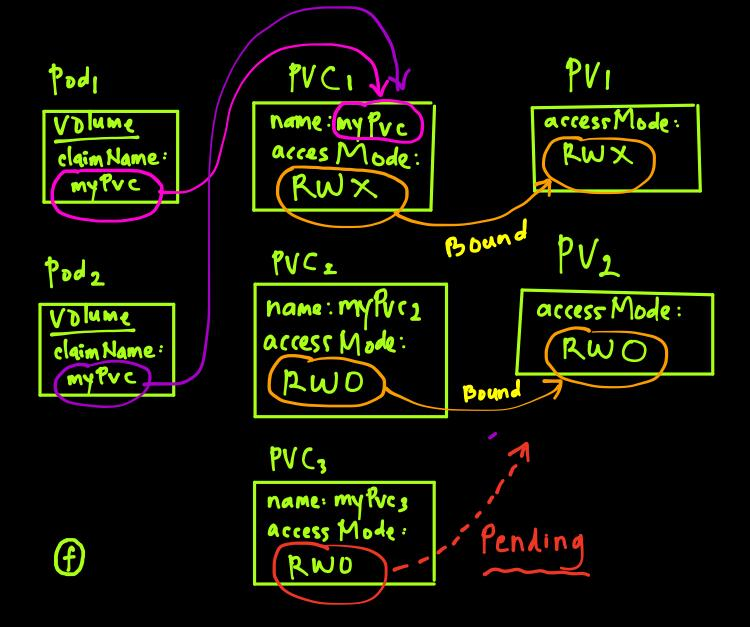

# CKA Exam Preparation

CKA = Certified Kubernetes Administrator</br>
Understand the CKA concept, prepare for the exam and practice, practice practices!

***

# Kubernetes Administration

**Disclaimer**: This is not likely a comprehensive list as the exam will be a moving target with the fast pace of k8s development - please make a pull request if there something wrong or that should be added, or updated in here.

Ensure you have the right version of Kubernetes documentation selected (e.g. v1.16 as of 20th Nov. 2019 exam) especially for API objects and annotations. This release removes several deprecated API's.  

## Exam Objectives

These are the exam objectives you review and understand in order to pass the test.

* [CNCF Exam Curriculum repository ](https://github.com/cncf/curriculum)


## [1. Core Concepts](https://kubernetes.io/docs/concepts/) 19%
<details> <summary> Details </summary>

* [Understand the Kubernetes API primitives](https://kubernetes.io/docs/reference/generated/kubernetes-api/v1.16/)
  * [concepts: Kubernetes Objects](https://kubernetes.io/docs/concepts/overview/working-with-objects/kubernetes-objects/)
  * youtube: [Kubernetes Webinar Series - Kubernetes Architecture 101](https://www.youtube.com/watch?v=zeS6OyDoy78)
* [Understand the Kubernetes cluster architecture](https://kubernetes.io/docs/concepts/overview/components/)
  * youtube: [A Technical Overview of Kubernetes (CoreOS Fest 2015) by Brendan Burns](https://www.youtube.com/watch?v=WwBdNXt6wO4)
* [Understand Services and other network primitives](https://kubernetes.io/docs/concepts/services-networking/service/)
  * youtube: [Life of a Packet [I] - Michael Rubin, Google](https://www.youtube.com/watch?v=0Omvgd7Hg1I)
  * youtube: [The ins and outs of networking in Google Container Engine and Kubernetes (Google Cloud Next '17)](https://www.youtube.com/watch?v=y2bhV81MfKQ)

* Architecture diagram



    **Master Node**
    - kube-apiserver: front-end of the cluster that services REST operations and connects to the etcd database
    - kube-scheduler: schedules Pods on specific nodes based on labels, taints, and tolerations set for the Pods
    - etcd: a B+tree key-value store that keeps the current cluster state
    - kube-controller-manager: manages current state of the cluster 
    - cloud-controller-manager: interacts with outside cloud managers 
    - Different optionals add-ons: 
        - DNS
        - Dashboard
        - Cluster level resource monitoring 
        - Cluster level logging 

    **Worker Node**
    - kubelet: passes requests to the container engine to ensure that Pods are available 
    - kube-proxy: runs on every node and uses iptables to provide an interface to connect to Kubernetes components
    - container runtime: takes care of actually running the containers 
    - supervisord: monitors and guarantee the availability of the kubelet and docker processes
    - network agent: implements software defined network solutions, such as weave
    - logging: the CNCF Project Fluentd is used for unified logging in the cluster. A Fluentd agent must be installed on the K8s nodes. 


*  Example Nginx deployment:
```yaml
apiVersion: apps/v1beta2 # for versions before 1.8.0 use apps/v1beta1
kind: Deployment
metadata:
  name: nginx-deployment
spec:
  replicas: 3
  selector:
    matchLabels:
      app: nginx
  template:
    metadata:
      labels:
        app: nginx
    spec:
      containers:
      - name: nginx
        image: nginx:1.7.9
        ports:
        - containerPort: 80
```

**Controlling API Access**
- API access is regulated by RBAC (Role Based Access Control)
- In RBAC, user accounts are identified as a set of certificates associated to name, defined in ~/.kube/conf (or /etc/kubernetes/admin.conf)
  ```bash
  current-context: kubernetes-admin@kubernetes
  kind: Config
  users:
  - name: kubernetes-admin
    user:
      client-certificate-data: LS0t....
      client-key-data: LS0t...
  ```
- Kubernetes distinguishes between the concept of a user account and a service account for a number of reasons:
  - User accounts are for humans. Service accounts are for processes, which run in pods.
  - User accounts are intended to be global and unique across all namespaces of a cluster. Service accounts are namespaced.
  - Typically, a cluster's User accounts might be synced from a corporate database, where new user account creation requires special privileges and is tied to complex business processes. Service account creation is intended to be more lightweight, allowing cluster users to create service accounts for specific tasks (i.e. principle of least privilege).
- Use kubectl auth can-i to verify what you can do with current credentials. 
  - kubectl auth can-i create deployments
  - kubectl auth can-i create pods --as linda
  - kubectl auth can-i create pods --as linda --namespaces apps

**Accessing the API**
- `kubectl api-resources` show API groups and resources within the APIs
- `kubectl api-versions`
- `kubectl explain`
- Kubectl auto-completion: `kubectl completion bash >> ~/.bashrc`. Relogin with user, and you should be able to do the kubectl auto-completion
- Or, you can make it available for all users by adding the below command: 
  ```bash
  kubectl completion bash >> /etc/bash_completion.d/kubectl
  ```

**Using `curl` to access the API**


- If the appropriate certificates are used, the API can be accessed by using **curl**
  - ```bash
    curl --cert myuser.pem --key myuser-key.pem --cacert /root/myca.pem https://controller:6443/api/v1
    ```
- **kubectl proxy** enable easy access to API without using certificates
  ```bash
  kubectl proxy --port 8001 &
  curl http://localhost:8001
  curl http://localhost:8001/api/v1/namespaces/default/pods
  kubectl get pods -n default -o json   # is giving the same result with the above command
  ```

**Understanding `etcdctl`**
- The `etcdctl` command can be used to interrogate and manage etcd database
- Different of versions exist: `etcdctl2` is to interract with v2 of API 
- `etcdctl` is version independent
- You need to install the package in advance: 
  ```bash
  yum install -y etcd
  ```
- Different version of etcd
  ```bash
  etcdctl --help  # This will give the default etcdctl version 2
  ETCDCTL_API=3 etcdctl --help  # This will give the etcdctl version 3
  ```


</details>


## [2. Installation, Configuration and Validation](https://github.com/kelseyhightower/kubernetes-the-hard-way/tree/f9486b081f8f54dd63a891463f0b0e783d084307) 12%
<details> <summary> Details </summary>

* Design a Kubernetes cluster
* [Install Kubernetes masters and nodes, including the use of TLS bootstrapping](https://kubernetes.io/docs/setup/production-environment/tools/kubeadm/install-kubeadm/)
* [Configure secure cluster communications](https://kubernetes.io/docs/tasks/tls/managing-tls-in-a-cluster/)
* [Configure a Highly-Available Kubernetes cluster](https://kubernetes.io/docs/admin/high-availability/)
* [Know where to get the Kubernetes release binaries](https://kubernetes.io/docs/getting-started-guides/binary_release/#prebuilt-binary-release)
* [Provision underlying infrastructure to deploy a Kubernetes cluster](https://github.com/kelseyhightower/kubernetes-the-hard-way/blob/f9486b081f8f54dd63a891463f0b0e783d084307/docs/01-infrastructure-gcp.md)
* [Choose a network solution](https://kubernetes.io/docs/concepts/cluster-administration/networking/)
* Choose your Kubernetes infrastructure configuration
* Run end-to-end tests on your cluster    
  * Some simple commands will cover most cases:
```
$ kubectl cluster-info
$ kubectl get nodes
$ kubectl get componentstatuses
$ kubectl get pods -o wide --show-labels --all-namespaces
$ kubectl get svc  -o wide --show-labels --all-namespaces
```

* Analyse end-to-end tests results.
* Install and use kubeadm to install, configure, and manage Kubernetes clusters.

* For more advanced end to end testing, which may not be covered on the exam, also see:
     * [End-To-End Testing in Kubernetes](https://github.com/kubernetes/community/blob/master/contributors/devel/sig-testing/e2e-tests.md)
     * [Using CNCF k8s conformance](https://github.com/cncf/k8s-conformance/blob/master/instructions.md)
     * [Heptio Sonobuoy Scanner](https://scanner.heptio.com/)

**Minikube architecture**
- Minikube is a minimum environment that manage to be functioned as Master and Worker node in single machine. 
- Minikube is good for CKAD practise, but a little difficult for CKA. 
- Architecture images: 


- **Kubernetes Cluster Installation**
    1. Cluster Node Requirement
        - To setup a Kubernetes on-premise cluster, **kubeadm** is used
        - On this Lab, we use 1 control node (master) and 2 worker node
        - Install the CentOS 7.x Minimal
        - Turn off swap space as required by kubelet to work (comment out swap on /etc/fstab and reboot the machine)
        - Disable the firewall or open appropriate port in the firewall
    2. **ON ALL NODES**
        - Lab environment: 
            - Master/Control Plane
                - 2 CPU (minimum requirement, otherwise `kubeadm init` will error)
                - 2 GB Memory
                - master.example.com
            - Worker
                - 1 GB Memory
                - worker1.example.com
                - worker2.example.com
        - Disable swap
        - Docker Runtime
            - Use docker-ce (community-edition)
        - Install base components
            ```bash
            yum install -y vim git bash-completion
            ```
        - Install some component with script
            ```bash
            git clone https://github.com/fahmifahim/kubernetes-cka.git
            cd kubernetes-cka/installation
            chmod u+x ./setup-docker.sh
            ./setup-docker.sh
            chmod u+x ./setup-kubetools.sh
            ./setup-kubetools.sh
            ```
        - Disabling firewall
        - Setting up kubernetes repo
        - Set SELinux in permisive mode
        - Install `kubelet` `kubeadm` `kubectl`
        - Setup hostname resolving on /etc/hosts

            <details><summary>setup-docker.sh and setup-kubetools.sh</summary>

            - setup-docker.sh

            ```bash
            #!/bin/bash
            # script that runs 
            # https://kubernetes.io/docs/setup/production-environment/container-runtime

            yum install -y vim yum-utils device-mapper-persistent-data lvm2
            yum-config-manager --add-repo https://download.docker.com/linux/centos/docker-ce.repo

            # notice that only verified versions of Docker may be installed
            # verify the documentation to check if a more recent version is available

            yum install -y docker-ce
            [ ! -d /etc/docker ] && mkdir /etc/docker

            cat > /etc/docker/daemon.json <<EOF
            {
            "exec-opts": ["native.cgroupdriver=systemd"],
            "log-driver": "json-file",
            "log-opts": {
                "max-size": "100m"
            },
            "storage-driver": "overlay2",
            "storage-opts": [
                "overlay2.override_kernel_check=true"
            ]
            }
            EOF

            cat >> /etc/hosts << EOF
            {
                192.168.11.14	master.example.com control master       # --> change this IP as your Lab environment
                192.168.11.15	worker1.example.com worker1             # --> change this IP as your Lab environment
                192.168.11.16	worker2.example.com worker2             # --> change this IP as your Lab environment
            }
            EOF

            mkdir -p /etc/systemd/system/docker.service.d

            systemctl daemon-reload
            systemctl restart docker
            systemctl enable docker

            systemctl disable --now firewalld
            ```

            - setup-kubetools.sh
            ```bash
            #!/bin/bash
            # kubeadm installation instructions as on
            # https://kubernetes.io/docs/setup/production-environment/tools/kubeadm/install-kubeadm/

            cat <<EOF > /etc/yum.repos.d/kubernetes.repo
            [kubernetes]
            name=Kubernetes
            baseurl=https://packages.cloud.google.com/yum/repos/kubernetes-el7-x86_64
            enabled=1
            gpgcheck=1
            repo_gpgcheck=1
            gpgkey=https://packages.cloud.google.com/yum/doc/yum-key.gpg https://packages.cloud.google.com/yum/doc/rpm-package-key.gpg
            EOF

            # Set SELinux in permissive mode (effectively disabling it)
            setenforce 0
            sed -i 's/^SELINUX=enforcing$/SELINUX=permissive/' /etc/selinux/config

            # disable swap (assuming that the name is /dev/centos/swap
            sed -i 's/^\/dev\/mapper\/centos-swap/#\/dev\/mapper\/centos-swap/' /etc/fstab
            swapoff /dev/mapper/centos-swap

            yum install -y kubelet kubeadm kubectl --disableexcludes=kubernetes

            systemctl enable --now kubelet

            # Set iptables bridging
            cat <<EOF >  /etc/sysctl.d/k8s.conf
            net.bridge.bridge-nf-call-ip6tables = 1
            net.bridge.bridge-nf-call-iptables = 1
            EOF
            sysctl --system
            ```

            </details>

    3. **ON MASTER/CONTROL PLANE**
        - `kubeadm init`

            <details><summary> kubeadm init (logs) </summary>
            
            ```bash
            kubeadm init
            W0506 16:48:54.526194    9665 configset.go:202] WARNING: kubeadm cannot validate component configs for API groups [kubelet.config.k8s.io kubeproxy.config.k8s.io]
            [init] Using Kubernetes version: v1.18.2
            [preflight] Running pre-flight checks
            [preflight] Pulling images required for setting up a Kubernetes cluster
            [preflight] This might take a minute or two, depending on the speed of your internet connection
            [preflight] You can also perform this action in beforehand using 'kubeadm config images pull'
            [kubelet-start] Writing kubelet environment file with flags to file "/var/lib/kubelet/kubeadm-flags.env"
            [kubelet-start] Writing kubelet configuration to file "/var/lib/kubelet/config.yaml"
            [kubelet-start] Starting the kubelet
            [certs] Using certificateDir folder "/etc/kubernetes/pki"
            [certs] Generating "ca" certificate and key
            [certs] Generating "apiserver" certificate and key
            [certs] apiserver serving cert is signed for DNS names [master.example.com kubernetes kubernetes.default kubernetes.default.svc kubernetes.default.svc.cluster.local] and IPs [10.96.0.1 192.168.11.14]
            [certs] Generating "apiserver-kubelet-client" certificate and key
            [certs] Generating "front-proxy-ca" certificate and key
            [certs] Generating "front-proxy-client" certificate and key
            [certs] Generating "etcd/ca" certificate and key
            [certs] Generating "etcd/server" certificate and key
            [certs] etcd/server serving cert is signed for DNS names [master.example.com localhost] and IPs [192.168.11.14 127.0.0.1 ::1]
            [certs] Generating "etcd/peer" certificate and key
            [certs] etcd/peer serving cert is signed for DNS names [master.example.com localhost] and IPs [192.168.11.14 127.0.0.1 ::1]
            [certs] Generating "etcd/healthcheck-client" certificate and key
            [certs] Generating "apiserver-etcd-client" certificate and key
            [certs] Generating "sa" key and public key
            [kubeconfig] Using kubeconfig folder "/etc/kubernetes"
            [kubeconfig] Writing "admin.conf" kubeconfig file
            [kubeconfig] Writing "kubelet.conf" kubeconfig file
            [kubeconfig] Writing "controller-manager.conf" kubeconfig file
            [kubeconfig] Writing "scheduler.conf" kubeconfig file
            [control-plane] Using manifest folder "/etc/kubernetes/manifests"
            [control-plane] Creating static Pod manifest for "kube-apiserver"
            [control-plane] Creating static Pod manifest for "kube-controller-manager"
            W0506 16:50:37.332345    9665 manifests.go:225] the default kube-apiserver authorization-mode is "Node,RBAC"; using "Node,RBAC"
            [control-plane] Creating static Pod manifest for "kube-scheduler"
            W0506 16:50:37.334387    9665 manifests.go:225] the default kube-apiserver authorization-mode is "Node,RBAC"; using "Node,RBAC"
            [etcd] Creating static Pod manifest for local etcd in "/etc/kubernetes/manifests"
            [wait-control-plane] Waiting for the kubelet to boot up the control plane as static Pods from directory "/etc/kubernetes/manifests". This can take up to 4m0s
            [apiclient] All control plane components are healthy after 35.529212 seconds
            [upload-config] Storing the configuration used in ConfigMap "kubeadm-config" in the "kube-system" Namespace
            [kubelet] Creating a ConfigMap "kubelet-config-1.18" in namespace kube-system with the configuration for the kubelets in the cluster
            [upload-certs] Skipping phase. Please see --upload-certs
            [mark-control-plane] Marking the node master.example.com as control-plane by adding the label "node-role.kubernetes.io/master=''"
            [mark-control-plane] Marking the node master.example.com as control-plane by adding the taints [node-role.kubernetes.io/master:NoSchedule]
            [bootstrap-token] Using token: 121svj.8urd4tdpt7r51p5n
            [bootstrap-token] Configuring bootstrap tokens, cluster-info ConfigMap, RBAC Roles
            [bootstrap-token] configured RBAC rules to allow Node Bootstrap tokens to get nodes
            [bootstrap-token] configured RBAC rules to allow Node Bootstrap tokens to post CSRs in order for nodes to get long term certificate credentials
            [bootstrap-token] configured RBAC rules to allow the csrapprover controller automatically approve CSRs from a Node Bootstrap Token
            [bootstrap-token] configured RBAC rules to allow certificate rotation for all node client certificates in the cluster
            [bootstrap-token] Creating the "cluster-info" ConfigMap in the "kube-public" namespace
            [kubelet-finalize] Updating "/etc/kubernetes/kubelet.conf" to point to a rotatable kubelet client certificate and key
            [addons] Applied essential addon: CoreDNS
            [addons] Applied essential addon: kube-proxy

            Your Kubernetes control-plane has initialized successfully!

            To start using your cluster, you need to run the following as a regular user:

            mkdir -p $HOME/.kube
            sudo cp -i /etc/kubernetes/admin.conf $HOME/.kube/config
            sudo chown $(id -u):$(id -g) $HOME/.kube/config

            You should now deploy a pod network to the cluster.
            Run "kubectl apply -f [podnetwork].yaml" with one of the options listed at:
            https://kubernetes.io/docs/concepts/cluster-administration/addons/

            Then you can join any number of worker nodes by running the following on each as root:

            kubeadm join 192.168.11.14:6443 --token 121svj.8urd4tdpt7r51p5n \
                --discovery-token-ca-cert-hash sha256:996d622a652b5ae512c1df35bf1560c252f0f70af8efee1a893849e5a7155231

            ```
            
            </details>

        - **Take a note of the `kubeadm join`** for the Token created

    4. **STARTING THE CLUSTER**
        - Create the client configuration as a regular user account
            ```bash
            su student
            mkdir -p $HOME/.kube
            sudo cp -l /etc/kubernetes/admin.conf $HOME/.kube/config
            sudo chown $(id -u):$(id -g) $HOME/.kube/config

            # Check the config file
            ls -l $HOME/.kube/config
               -rw-------. 1 student student 5453 May  6 17:00 config
            cat $HOME/.kube/config

            # (Optional) Your root user may also copy the config file to its directory
            sudo su -
            mkdir -p $HOME/.kube
            cp -l /etc/kubernetes/admin.conf $HOME/.kube/config
                --> Now your root user can call the kubectl command too
            ```
        - Verify by `kubectl cluster-info`
            ```bash
            $ kubectl cluster-info
            Kubernetes master is running at https://192.168.11.14:6443
            KubeDNS is running at https://192.168.11.14:6443/api/v1/namespaces/kube-system/services/kube-dns:dns/proxy

            To further debug and diagnose cluster problems, use 'kubectl cluster-info dump'.
            ```
        - `kubectl get nodes` (will give you not ready status at this point. it is normal)
            ```bash
            $ kubectl get nodes
            NAME                 STATUS     ROLES    AGE   VERSION
            master.example.com   NotReady   master   16m   v1.18.2
            ```
    5. **[Installing a Pod Network Add-on](https://kubernetes.io/docs/setup/production-environment/tools/kubeadm/create-cluster-kubeadm/#pod-network)**
        - A Network Add-on must be installed for pods to communicate
        - CNI (Container Network Interface) which work with add-ons to implement networking
        - Look for an add-on that supports `network-policy` as well as RBAC
        - Common pod network plugin: 
            - Weave: a common ad-on for a CNI-enabled Kubernetes cluster
            - Flannel: a layer 3 IPV4 network between cluster nodes that can use several backend mechanism such as VXLAN
            - Calico: a layer 3 network solution that uses IP encapsulation and is used in Kubernetes, OpenStack, OpenShift, Docker, etc
            - AWS VPC: network plugin commonly used for AWS environment
        - Network plugin is installed from control plane (master node)
        - In our lab, we apply the Weave plugin: 
            ```bash
            # Install the network plugin from Master node
            $ kubectl apply -f "https://cloud.weave.works/k8s/net?k8s-version=$(kubectl version | base64 | tr -d '\n')"
                serviceaccount/weave-net created
                clusterrole.rbac.authorization.k8s.io/weave-net created
                clusterrolebinding.rbac.authorization.k8s.io/weave-net created
                role.rbac.authorization.k8s.io/weave-net created
                rolebinding.rbac.authorization.k8s.io/weave-net created
                daemonset.apps/weave-net created    

            $ kubectl get pods --all-namespaces
                NAMESPACE     NAME                                         READY   STATUS    RESTARTS   AGE
                kube-system   coredns-66bff467f8-2vqrg                     1/1     Running   0          31m
                kube-system   coredns-66bff467f8-fnq7h                     1/1     Running   0          31m
                kube-system   etcd-master.example.com                      1/1     Running   0          31m
                kube-system   kube-apiserver-master.example.com            1/1     Running   0          31m
                kube-system   kube-controller-manager-master.example.com   1/1     Running   0          31m
                kube-system   kube-proxy-tbdzc                             1/1     Running   0          31m
                kube-system   kube-scheduler-master.example.com            1/1     Running   0          31m
                kube-system   weave-net-tp5b9                              2/2     Running   0          72s

            ! Make sure all the above pods are "Running" before you move forward to join the worker node to the cluster

            $ kubectl get nodes
                NAME                 STATUS   ROLES    AGE   VERSION
                master.example.com   Ready    master   33m   v1.18.2

            $ exit 

            ```
    6. **JOINING WORKER NODE**
        - Use the command from `kubeadm join` as we noted on the previous procedure
            ```bash
            kubeadm join 192.168.11.14:6443 --token 121svj.8urd4tdpt7r51p5n \
                --discovery-token-ca-cert-hash sha256:996d622a652b5ae512c1df35bf1560c252f0f70af8efee1a893849e5a7155231
            ```
        - Execute the `kubeadm join ...` at each worker nodes
            ```bash
            ssh worker1
                root@worker1's password:
                Last login: Wed May  6 17:30:47 2020 from master.example.com
            
            # Copy paste the kubeadm join
            kubeadm join 192.168.11.14:6443 --token 121svj.8urd4tdpt7r51p5n \
                --discovery-token-ca-cert-hash sha256:996d622a652b5ae512c1df35bf1560c252f0f70af8efee1a893849e5a7155231

            # Result: 
                W0506 17:32:39.026771    5170 join.go:346] [preflight] WARNING: JoinControlPane.controlPlane settings will be ignored when control-plane flag is not set.
                [preflight] Running pre-flight checks
                [preflight] Reading configuration from the cluster...
                [preflight] FYI: You can look at this config file with 'kubectl -n kube-system get cm kubeadm-config -oyaml'
                [kubelet-start] Downloading configuration for the kubelet from the "kubelet-config-1.18" ConfigMap in the kube-system namespace
                [kubelet-start] Writing kubelet configuration to file "/var/lib/kubelet/config.yaml"
                [kubelet-start] Writing kubelet environment file with flags to file "/var/lib/kubelet/kubeadm-flags.env"
                [kubelet-start] Starting the kubelet
                [kubelet-start] Waiting for the kubelet to perform the TLS Bootstrap...

                This node has joined the cluster:
                * Certificate signing request was sent to apiserver and a response was received.
                * The Kubelet was informed of the new secure connection details.

                Run 'kubectl get nodes' on the control-plane to see this node join the cluster.
            ```
        - Make sure the **docker and kubelet** are in active status
          - docker and kubelet are crucial processes for your Kubernetes cluster
          - Set both process as auto enable when the node is up `systemctl enable docker`
          ```bash
          # Set as auto-start process
          systemctl enable docker
          systemctl enable kubelet
          systemctl is-enable docker
          systemctl is-enable kubelet
          
          systemctl status docker | grep Active:
              Active: active (running) since Tue 2020-05-12 00:49:18 EDT; 2 weeks 6 days ago
          systemctl status kubelet | grep Active:
              Active: active (running) since Sat 2020-05-30 03:36:12 EDT; 2 days ago    
          ```

            ```bash
            [student@master root]$ kubectl get nodes
                NAME                  STATUS   ROLES    AGE     VERSION
                master.example.com    Ready    master   51m     v1.18.2
                worker1.example.com   Ready    <none>   9m37s   v1.18.2
                worker2.example.com   Ready    <none>   77s     v1.18.2
            ```
    7. Check the `kubectl config view`
        ```bash
        $ kubectl config view
            apiVersion: v1
            clusters:
            - cluster:
                certificate-authority-data: DATA+OMITTED
                server: https://192.168.11.14:6443
            name: kubernetes
            contexts:
            - context:
                cluster: kubernetes
                user: kubernetes-admin
            name: kubernetes-admin@kubernetes
            current-context: kubernetes-admin@kubernetes
            kind: Config
            preferences: {}
            users:
            - name: kubernetes-admin
            user:
                client-certificate-data: REDACTED
                client-key-data: REDACTED    
        ```

</details>

## 3. Security 12%
<details> <summary> Details </summary>

* [Securing a kubernetes cluster](https://kubernetes.io/docs/tasks/administer-cluster/securing-a-cluster/)
    * youtube: [Building for Trust: How to Secure Your Kubernetes Cluster [I] - Alexander Mohr & Jess Frazelle](https://www.youtube.com/watch?v=YRR-kZub0cA)
* [Know how to configure authentication and authorization](https://kubernetes.io/docs/admin/authorization/rbac/)
  * [Access the api](https://kubernetes.io/docs/admin/accessing-the-api/)
  * [Authentication](https://kubernetes.io/docs/reference/access-authn-authz/authentication/)
  * [Authorization with RBAC](https://kubernetes.io/docs/admin/authorization/rbac/)
  * [Admission Control](https://kubernetes.io/docs/admin/admission-controllers/)
* [Understand Kubernetes security primitives]
  * [Pod Security Policy](https://kubernetes.io/docs/concepts/policy/pod-security-policy/)
    * [PSP and RBAC](https://github.com/kubernetes/examples/blob/master/staging/podsecuritypolicy/rbac/README.md)
* [Know to configure network policies](https://kubernetes.io/docs/tasks/administer-cluster/declare-network-policy/)
  * [Blog: Kubernetes network policy](https://ahmet.im/blog/kubernetes-network-policy/)
  * [Katacoda Calico](https://www.katacoda.com/projectcalico/scenarios/calico)
* [Create and manage TLS certificates for cluster components](https://kubernetes.io/docs/tasks/tls/managing-tls-in-a-cluster/)
* Work with images securely
* [Define security contexts](https://kubernetes.io/docs/tasks/configure-pod-container/security-context/)
* [Secure persistent key value store](https://kubernetes.io/docs/concepts/configuration/secret/)

- Understanding Certificates and API Access
  - The API serves on port 6443 by default
  - The API often is self-signed. The root certificate for the API server certificate is $USER/.kube/config
  - The user need to present its own client certificate to get access to the API

- Understanding API Access: **Authentication**
  - Authentication: **Authentication Modules** are used to include client certificates, password or tokens to handle authentication of human and service accounts
    - Human accounts typically use client certificates
    - Service accounts typically use tokens
  - Requests that can't be authenticated are rejected with HTTP status code 401
  - Remember, Kubernetes doesn't have User Objects. A User is just a set of client certificates
  - Three essential certificate components in $USER/.kube/config:
    - client-certificate-data: contains the client public key certificate
    - client-key-data: contains the client private key
    - certificate-authority-data: contains the CA public key certificate
  - Here sample of manual access of CURL: 
    ```bash
    # Define the certificate components:
    export client=$(grep client-certificate-data ~/.kube/config | cut -d " " -f 6)
    export key=$(grep client-key-data ~/.kube/config | cut -d " " -f 6)
    export auth=$(grep certificate-authority-data ~/.kube/config | cut -d " " -f 6)

    # Generate certificate files (.pem files)
    echo $client | base64 -d - > client.pem
    echo $key | base64 -d - > key.pem
    echo $auth | base64 -d - > ca.pem

    # Find out the target API server
    kubectl config view | grep server
        server: https://192.168.11.25:6443

    # Get the Pods by CURL command using the above certificate files
    curl --cert ./client.pem --key ./key.pem --cacert ./ca.pem https://192.168.11.25:6443/api/v1/pods

    ```

- Understanding API Access: **Authorization**
  - After establishing that a request comes from specific user, it must be authorized
  - Kubernetes is doing this by using `Authorization Modes`
    - ABAC (Attribute Based Access Control)
    - RBAC (Role Based Access Control)
      - Role: used to grant access to resources within a single namespace
      - ClusterRole: used to grant access to resources at a Cluster Level (beyond namespace)
      - RoleBinding: used to grant permissions defined in a role to one or more users. 
      - ClusterRoleBinding: used to grant permission at the cluster level and in all namespaces
    - Webhook (Uses HTTP POST when something happens)
  - Authorization module is specified when kube-apiserver is started
  - See the /etc/kubernetes/manifests/
    - etcd.yaml
    - kube-apiserver.yaml   --> this file to change the Authorization
    - kube-controller-manager.yaml
    - kube-scheduler
  - Here is inside the `kube-apiserver` pods
    ```yaml
    kind: Pod
    metadata:
      name: kube-apiserver
      namespace: kube-system
    spec:
      containers:
      - command:
        - kube-apiserver
        - --authorization-mode=Node,RBAC
        - --client-ca-file=/etc/kubernetes/pki/ca.crt
        - --enable-admission-plugins=NodeRestriction
        - --enable-bootstrap-token-auth=true
        - --etcd-cafile=/etc/kubernetes/pki/etcd/ca.crt
        - --etcd-certfile=/etc/kubernetes/pki/apiserver-etcd-client.crt
        - --etcd-keyfile=/etc/kubernetes/pki/apiserver-etcd-client.key
        - --etcd-servers=https://127.0.0.1:2379
        - --insecure-port=0
        - --secure-port=6443
        - --kubelet-client-certificate=/etc/kubernetes/pki/apiserver-kubelet-client.crt
        - --kubelet-client-key=/etc/kubernetes/pki/apiserver-kubelet-client.key
        - --kubelet-preferred-address-types=InternalIP,ExternalIP,Hostname
        - --proxy-client-cert-file=/etc/kubernetes/pki/front-proxy-client.crt
        - --proxy-client-key-file=/etc/kubernetes/pki/front-proxy-client.key
        - --requestheader-allowed-names=front-proxy-client
    ```
- Understanding API Access: **Admission**
  - After being authorized, the admission controller is involved
  - Admission controllers implement specific functionality. Such as, ResourceQuota will ensure an object doesn't violate any existing quota rules
  - A list of additional admission can be included and activated from the /etc/kubernetes/manifests/kube-apiserver.yaml


### Managing Kubernetes User Account
  - Kubernetes has no User Objects. User accounts consist of an authorized certificate that is completed with some authorization as defined in RBAC
  - To create a user account, perform the following steps: 
    - Create a public/private key pair
    - Create a Certificate Signing Request (CSR)
    - Sign the Certificate
    - Create a configuration file that uses these keys to access the K8s cluster
    - Create an RBAC Role
    - Create an RBAC RoleBinding



#### Creating User Accounts
##### Step 1: Create a user working environment
- Create several different namespaces: 
  - kubectl create namespace staff
  - kubectl create namespace students
  - kubectl config get-contexts

<details>

```bash
kubectl get ns
    NAME              STATUS   AGE
    default           Active   20d
    dev               Active   12d
    kube-node-lease   Active   20d
    kube-public       Active   20d
    kube-system       Active   20d
    staff             Active   30s
    students          Active   23s

kubectl config get-contexts
    CURRENT   NAME                          CLUSTER      AUTHINFO           NAMESPACE
    *         kubernetes-admin@kubernetes   kubernetes   kubernetes-admin   dev
```

</details>

##### Step 2: Create the User account (username: fahmi)
- useradd -G wheel fahmi
- passwd fahmi
- openssl genrsa -out fahmi.key 2048
- openssl req -new -key fahmi.key -out fahmi.csr -subj "/CN=fahmi/O=staff"
- openssl x509 -req -in fahmi.csr -CA /etc/kubernetes/pki/ca.crt -CAkey /etc/kubernetes/pki/ca.key -CAcreateserial -out fahmi.crt -days 365

<details>

```bash
useradd -G wheel fahmi

id fahmi
    uid=1001(fahmi) gid=1001(fahmi) groups=1001(fahmi),10(wheel)

passwd fahmi
    Changing password for user fahmi.
    New password:
    BAD PASSWORD: The password fails the dictionary check - it is based on a dictionary word
    Retype new password:
    passwd: all authentication tokens updated successfully.

openssl genrsa -out fahmi.key 2048
    Generating RSA private key, 2048 bit long modulus
    ..+++
    ..................................................+++
    e is 65537 (0x10001)

ls -lth
    total 24K
    -rw-r--r--. 1 root root 1.7K May 28 21:40 fahmi.key

openssl req -new -key fahmi.key -out fahmi.csr -subj "/CN=fahmi/O=staff"

ls -lth
    total 28K
    -rw-r--r--. 1 root root  907 May 28 21:41 fahmi.csr
    -rw-r--r--. 1 root root 1.7K May 28 21:40 fahmi.key

openssl x509 -req -in fahmi.csr -CA /etc/kubernetes/pki/ca.crt -CAkey /etc/kubernetes/pki/ca.key -CAcreateserial -out fahmi.crt -days 365
    Signature ok
    subject=/CN=fahmi/O=staff
    Getting CA Private Key

ls -lth
    total 32K
    -rw-r--r--. 1 root root  993 May 28 21:43 fahmi.crt
    -rw-r--r--. 1 root root  907 May 28 21:41 fahmi.csr
    -rw-r--r--. 1 root root 1.7K May 28 21:40 fahmi.key

openssl x509 -text -in fahmi.crt
    Certificate:
        Data:
            Version: 1 (0x0)
            Serial Number:
                98:c0:d3:38:5e:30:23:ff
        Signature Algorithm: sha256WithRSAEncryption
            Issuer: CN=kubernetes
            Validity
                Not Before: May 28 12:43:00 2020 GMT
                Not After : May 28 12:43:00 2021 GMT
            Subject: CN=fahmi, O=staff
            Subject Public Key Info:
                Public Key Algorithm: rsaEncryption
                    Public-Key: (2048 bit)
                    Modulus:
                        00:d1:74:a5:f4:7e:63:3c:2c:e0:f5:5c:c6:40:e1:
                        bb:61:d8:bf:c6:e1:de:05:ab:14:00:dc:7f:00:92:
                        32:dd:d7:33:7d:22:2d:aa:bd:df:e3:e2:c5:6d:f2:
                        99:1b:d4:44:b1:91:77:79:54:3e:77:49:ed:9d:aa:
                        75:90:89:80:43:5b:f5:3d:54:80:1a:81:48:e0:e8:
                        03:8b:69:c9:d7:64:3a:d2:94:6d:b5:15:40:82:55:
                        ac:b0:25:3f:6a:96:a0:b9:2d:8d:c3:f1:12:be:c6:
                        19:34:d9:16:75:b2:39:ac:24:fb:69:d1:da:4e:88:
                        db:f0:9d:cd:c0:29:99:56:fb:3e:fe:92:1b:92:34:
                        a2:4e:4f:04:76:59:b1:33:aa:0b:56:41:f0:95:21:
                        f3:8e:f3:05:44:a9:f7:c4:5c:3b:64:f1:62:12:45:
                        3a:af:e9:8b:c8:61:21:c1:c0:79:02:47:ef:ec:05:
                        1d:7f:98:1f:19:58:b2:9f:68:b2:3a:12:9c:1a:0d:
                        3e:10:e3:fc:55:81:33:4c:39:21:70:24:87:44:01:
                        aa:a9:e1:66:5c:85:14:63:86:59:65:c0:61:40:5d:
                        e6:d6:3a:c8:46:c8:51:2c:d0:e1:40:42:72:86:42:
                        3f:30:5a:7d:06:00:ed:c8:8d:c8:3c:53:b1:f9:e1:
                        a8:31
                    Exponent: 65537 (0x10001)
        Signature Algorithm: sha256WithRSAEncryption
            8c:d5:bb:d3:d1:4f:fb:73:a4:7f:59:2a:0d:0b:56:37:62:f0:
            c4:9c:91:73:2f:e2:f4:08:f9:34:d5:a8:4b:31:9b:d2:eb:15:
            a4:89:d2:91:c9:83:78:5c:98:b2:94:89:9d:84:5d:9a:c0:80:
            ea:0f:6a:e6:61:12:97:95:e9:4a:14:02:3a:b0:ab:4a:03:5b:
            f4:7f:43:f4:25:d1:86:cb:8d:a0:97:d9:06:5b:09:b1:ae:7c:
            92:f7:4c:ee:ff:a1:35:e6:63:10:f8:61:d2:b2:23:7c:a4:ce:
            0b:99:13:b5:51:86:46:14:08:5b:3e:03:69:f7:c4:9b:a7:45:
            4d:30:1e:9d:eb:af:84:2a:c3:61:01:a2:eb:1d:f9:3d:9f:35:
            a3:7c:b9:8f:72:9a:1a:a3:aa:d0:2b:86:15:f8:f3:7a:64:59:
            23:e0:d7:d7:a1:b6:b1:99:f0:77:f9:2f:e8:55:43:1e:45:1d:
            4f:6d:be:01:91:78:f7:ed:89:9e:c1:dc:ad:79:35:5a:b9:0d:
            12:31:ae:4d:ad:d8:89:5b:82:69:0f:59:3f:79:97:16:14:de:
            ef:8e:02:f2:bc:ce:b9:99:f7:0b:28:08:83:dc:02:60:3e:0f:
            23:65:f8:48:63:85:53:5e:c9:5e:47:c6:9e:8b:48:00:8e:d4:
            de:f9:71:0a
    -----BEGIN CERTIFICATE-----
    MIICsTCCAZkCCQCYwNM4XjAj/zANBgkqhkiG9w0BAQsFADAVMRMwEQYDVQQDEwpr
    dWJlcm5ldGVzMB4XDTIwMDUyODEyNDMwMFoXDTIxMDUyODEyNDMwMFowIDEOMAwG
    A1UEAwwFZmFobWkxDjAMBgNVBAoMBXN0YWZmMIIBIjANBgkqhkiG9w0BAQEFAAOC
    AQ8AMIIBCgKCAQEA0XSl9H5jPCzg9VzGQOG7Ydi/xuHeBasUANx/AJIy3dczfSIt
    qr3f4+LFbfKZG9REsZF3eVQ+d0ntnap1kImAQ1v1PVSAGoFI4OgDi2nJ12Q60pRt
    tRVAglWssCU/apaguS2Nw/ESvsYZNNkWdbI5rCT7adHaTojb8J3NwCmZVvs+/pIb
    kjSiTk8EdlmxM6oLVkHwlSHzjvMFRKn3xFw7ZPFiEkU6r+mLyGEhwcB5Akfv7AUd
    f5gfGViyn2iyOhKcGg0+EOP8VYEzTDkhcCSHRAGqqeFmXIUUY4ZZZcBhQF3m1jrI
    RshRLNDhQEJyhkI/MFp9BgDtyI3IPFOx+eGoMQIDAQABMA0GCSqGSIb3DQEBCwUA
    A4IBAQCM1bvT0U/7c6R/WSoNC1Y3YvDEnJFzL+L0CPk01ahLMZvS6xWkidKRyYN4
    XJiylImdhF2awIDqD2rmYRKXlelKFAI6sKtKA1v0f0P0JdGGy42gl9kGWwmxrnyS
    90zu/6E15mMQ+GHSsiN8pM4LmRO1UYZGFAhbPgNp98Sbp0VNMB6d66+EKsNhAaLr
    Hfk9nzWjfLmPcpoao6rQK4YV+PN6ZFkj4NfXobaxmfB3+S/oVUMeRR1Pbb4BkXj3
    7YmewdyteTVauQ0SMa5NrdiJW4JpD1k/eZcWFN7vjgLyvM65mfcLKAiD3AJgPg8j
    ZfhIY4VTXsleR8aei0gAjtTe+XEK
    -----END CERTIFICATE-----
```

</details>

##### Step 3: View and update the Kubernetes Credentials Files for the new user (fahmi)
- kubectl config view
- kubectl config set-credentials fahmi --client-certificate=./fahmi.crt --client-key=./fahmi.key
- kubectl config view

<details>

```bash
kubectl config view
    apiVersion: v1
    clusters:
    - cluster:
        certificate-authority-data: DATA+OMITTED
        server: https://192.168.11.25:6443
      name: kubernetes
    contexts:
    - context:
        cluster: kubernetes
        namespace: dev
        user: kubernetes-admin
      name: kubernetes-admin@kubernetes
    current-context: kubernetes-admin@kubernetes
    kind: Config
    preferences: {}
    users:
    - name: kubernetes-admin
      user:
        client-certificate-data: REDACTED
        client-key-data: REDACTED

ls -lth
    -rw-r--r--. 1 root root  993 May 28 21:43 fahmi.crt
    -rw-r--r--. 1 root root  907 May 28 21:41 fahmi.csr
    -rw-r--r--. 1 root root 1.7K May 28 21:40 fahmi.key


kubectl config set-credentials fahmi --client-certificate=./fahmi.crt --client-key=./fahmi.key
    User "fahmi" set.

kubectl config view
    apiVersion: v1
    clusters:
    - cluster:
        certificate-authority-data: DATA+OMITTED
        server: https://192.168.11.25:6443
      name: kubernetes
    contexts:
    - context:
        cluster: kubernetes
        namespace: dev
        user: kubernetes-admin
      name: kubernetes-admin@kubernetes
    current-context: kubernetes-admin@kubernetes
    kind: Config
    preferences: {}
    users:
    - name: fahmi
      user:
        client-certificate: /root/fahmi.crt
        client-key: /root/fahmi.key
    - name: kubernetes-admin
      user:
        client-certificate-data: REDACTED
        client-key-data: REDACTED
```

</details>

##### Step  4: Create a Default Context for the new user (fahmi)
- kubectl config set-context fahmi-context --cluster=kubernetes --namespace=staff --user=fahmi
- kubectl get pods --context=fahmi-context (This will fail as no RBAC has been configured yet)
- kubectl config get-contexts

<details>

```bash
kubectl config set-context fahmi-context --cluster=kubernetes --namespace=staff --user=fahmi
    Context "fahmi-context" created.

kubectl --context=fahmi-context get pods
    Error from server (Forbidden): pods is forbidden: User "fahmi" cannot list resource "pods" in API group "" in the namespace "staff"

kubectl config get-contexts
    CURRENT   NAME                          CLUSTER      AUTHINFO           NAMESPACE
              fahmi-context                 kubernetes   fahmi              staff
    *         kubernetes-admin@kubernetes   kubernetes   kubernetes-admin   dev
```

</details>

##### Step 5: Configure Role RBAC to define a staff role
- vim staff-role.yaml
- kubectl create -f staff-role.yaml

```yaml
apiVersion: rbac.authorization.k8s.io/v1beta1
kind: Role
metadata: 
  namespace: staff
  name: staff-role
rules: 
- apiGroups: ["", "extensions", "apps"]
  resources: ["deployments", "replicasets", "pods"]
  verbs: ["list", "get", "watch", "create", "update", "patch"]  # Notice there is no "delete" on verbs, so this Role doesn't have authority to delete resources
```

##### Step 6: Bid a user to the new role
- vim rolebind.yaml
- kubectl create -f rolebind.yaml

```yaml
apiVersion: rbac.authorization.k8s.io/v1beta1
kind: RoleBinding
metadata: 
  name: staff-rolebinding
  namespace: staff
subjects: 
- kind: User
  name: fahmi
  apiGroup: ""
roleRef:
  kind: Role
  name: staff-role
  apiGroup: ""
```

```bash
kubectl get role -n staff
    NAME         CREATED AT
    staff-role   2020-05-28T13:39:28Z

kubectl describe role staff-role -n staff
    Name:         staff-role
    Labels:       <none>
    Annotations:  <none>
    PolicyRule:
      Resources               Non-Resource URLs  Resource Names  Verbs
      ---------               -----------------  --------------  -----
      deployments             []                 []              [list get watch create update patch]
      pods                    []                 []              [list get watch create update patch]
      replicasets             []                 []              [list get watch create update patch]
      deployments.apps        []                 []              [list get watch create update patch]
      pods.apps               []                 []              [list get watch create update patch]
      replicasets.apps        []                 []              [list get watch create update patch]
      deployments.extensions  []                 []              [list get watch create update patch]
      pods.extensions         []                 []              [list get watch create update patch]
      replicasets.extensions  []                 []              [list get watch create update patch]

kubectl get rolebinding -n staff
    NAME                ROLE              AGE
    staff-rolebinding   Role/staff-role   30s

kubectl describe rolebinding staff-rolebinding -n staff
    Name:         staff-rolebinding
    Labels:       <none>
    Annotations:  <none>
    Role:
      Kind:  Role
      Name:  staff-role
    Subjects:
      Kind  Name   Namespace
      ----  ----   ---------
      User  fahmi

```

##### Step 7: Test it
- kubectl get pods --context=fahmi-context
- kubectl create deployment nginx --image=nginx 
- kubectl get pods --context=fahmi-context
- kubectl delete pods <pod-name> --context=fahmi-context  # **Notice** this operation will fail. No "delete" in staff-role!
- kubectl describe role staff -n staff
- kubectl edit role staff-role  --> Add "delete" on verbs
- kubectl delete pods <pod-name> --context=fahmi-context  # Make sure delete is success
- kubectl describe role staff -n staff

<details>

```bash
kubectl --context fahmi-context get pods
    No resources found in staff namespace.

kubectl create deployment nginx --image nginx
    deployment.apps/nginx created

kubectl get pods --context fahmi-context
    NAME                    READY   STATUS    RESTARTS   AGE
    nginx-f89759699-lbzq7   1/1     Running   0          4m12s

kubectl delete pod nginx-f89759699-l6xcg --context fahmi-context
    Error from server (Forbidden): pods "nginx-f89759699-lbzq7" is forbidden: User "fahmi" cannot delete resource "pods" in API group "" in the namespace "staff"

kubectl describe role staff-role
    Name:         staff-role
    Labels:       <none>
    Annotations:  <none>
    PolicyRule:
      Resources               Non-Resource URLs  Resource Names  Verbs
      ---------               -----------------  --------------  -----
      deployments             []                 []              [list get watch create update patch]
      pods                    []                 []              [list get watch create update patch]
      replicasets             []                 []              [list get watch create update patch]
      deployments.apps        []                 []              [list get watch create update patch]
      pods.apps               []                 []              [list get watch create update patch]
      replicasets.apps        []                 []              [list get watch create update patch]
      deployments.extensions  []                 []              [list get watch create update patch]
      pods.extensions         []                 []              [list get watch create update patch]
      replicasets.extensions  []                 []              [list get watch create update patch]

kubectl edit role staff-role
    ...
      verbs:
      - list
      - get
      - watch
      - create
      - update
      - patch
      - delete    # --> Add this new entry :wq! to exit

    role.rbac.authorization.k8s.io/staff-role edited

kubectl delete pod nginx-f89759699-lbzq7 --context fahmi-context
    pod "nginx-f89759699-lbzq7" deleted

kubectl describe role staff-role
    Name:         staff-role
    Labels:       <none>
    Annotations:  <none>
    PolicyRule:
      Resources               Non-Resource URLs  Resource Names  Verbs
      ---------               -----------------  --------------  -----
      deployments             []                 []              [list get watch create update patch delete]
      pods                    []                 []              [list get watch create update patch delete]
      replicasets             []                 []              [list get watch create update patch delete]
      deployments.apps        []                 []              [list get watch create update patch delete]
      pods.apps               []                 []              [list get watch create update patch delete]
      replicasets.apps        []                 []              [list get watch create update patch delete]
      deployments.extensions  []                 []              [list get watch create update patch delete]
      pods.extensions         []                 []              [list get watch create update patch delete]
      replicasets.extensions  []                 []              [list get watch create update patch delete]
```
</details>

##### Step 8: Create a View-only Role
- vim students-role.yaml
- vim student-rolebinding.yaml
- kubectl apply -f students-role.yaml
- kubectl apply -f student-rolebinding.yaml

<details>

```yaml
apiVersion: rbac.authorization.k8s.io/v1beta1
kind: Role
metadata: 
  namespace: students
  name: students-role
rules: 
- apiGroups: ["", "extensions", "apps"]
  resources: ["deployments", "replicasets", "pods"]
  verbs: ["list", "get", "watch"] 
```

```yaml
apiVersion: rbac.authorization.k8s.io/v1beta1
kind: RoleBinding
metadata: 
  name: student-rolebinding
  namespace: students
subjects: 
- kind: User
  name: fahmi
  apiGroup: ""
roleRef:
  kind: Role
  name: student-role
  apiGroup: ""
```

</details>

##### Step 9: Test it
- kubectl config set-config fahmistudents-context --cluster kubernetes --namespace students --user fahmi
- kubectl get pods --context fahmistudents-context 
- kubectl describe role students

</details>

## [4. Networking](https://kubernetes.io/docs/concepts/cluster-administration/networking/) 11%
<details> <summary> Details </summary>

* [Understand the networking configuration on the cluster nodes](https://kubernetes.io/docs/concepts/cluster-administration/networking/)
* Understand Pod networking concepts
  * youtube: [The ins and outs of networking in Google Container Engine and Kubernetes (Google Cloud Next '17)](https://www.youtube.com/watch?v=y2bhV81MfKQ)
  * youtube: [Networking with Kubernetes](https://www.youtube.com/watch?v=WwQ62OyCNz4)
  * [Illustrated Guide To Kubernetes Networking by Tim Hockin](https://speakerdeck.com/thockin/illustrated-guide-to-kubernetes-networking)
* Understand service networking
  * youtube: [Life of a Packet [I] - Michael Rubin, Google](https://www.youtube.com/watch?v=0Omvgd7Hg1I)
* [Deploy and configure network load balancer](https://kubernetes.io/docs/tasks/access-application-cluster/create-external-load-balancer/)
* [Know how to use Ingress rules](https://kubernetes.io/docs/concepts/services-networking/ingress/)
* [Know how to configure and use the cluster DNS](https://kubernetes.io/docs/concepts/services-networking/dns-pod-service/)
* [Understand CNI](https://github.com/containernetworking/cni)
  * [More information on CNI](http://www.dasblinkenlichten.com/understanding-cni-container-networking-interface/)


- Pods Network diagram

  - Pod is holding an IP address. 
  - In a pod there is an administrative container called **Pause Container**. It responsible for managing the IP address
  - In multiple-containers scenario, each container need to find a way to communicate each other. 
    - IPC : Inter Process Communication
    - Shared Volume
    - Loopback address
  - Pause Container can be determined by the below command on Master node:
    ```bash
    --> In this example we are using net-demo Pod
    $ kubectl exec -it net-demo -c container1-busybox -- ip  a show
        1: lo: <LOOPBACK,UP,LOWER_UP> mtu 65536 qdisc noqueue qlen 1000
            link/loopback 00:00:00:00:00:00 brd 00:00:00:00:00:00
            inet 127.0.0.1/8 scope host lo
              valid_lft forever preferred_lft forever
        172: eth0@if173: <BROADCAST,MULTICAST,UP,LOWER_UP,M-DOWN> mtu 1376 qdisc noqueue
            link/ether 02:c8:4b:fa:b2:55 brd ff:ff:ff:ff:ff:ff
            inet 10.44.0.6/12 brd 10.47.255.255 scope global eth0
              valid_lft forever preferred_lft forever

    $ kubectl exec -it net-demo -c container2-busybox -- ip  a show
        1: lo: <LOOPBACK,UP,LOWER_UP> mtu 65536 qdisc noqueue qlen 1000
            link/loopback 00:00:00:00:00:00 brd 00:00:00:00:00:00
            inet 127.0.0.1/8 scope host lo
              valid_lft forever preferred_lft forever
        172: eth0@if173: <BROADCAST,MULTICAST,UP,LOWER_UP,M-DOWN> mtu 1376 qdisc noqueue
            link/ether 02:c8:4b:fa:b2:55 brd ff:ff:ff:ff:ff:ff
            inet 10.44.0.6/12 brd 10.47.255.255 scope global eth0
              valid_lft forever preferred_lft forever

    $ kubectl get pod -o wide
        NAME             READY   STATUS    RESTARTS   AGE     IP          NODE                     NOMINATED NODE   READINESS GATES
        net-demo         2/2     Running   0          7m29s   10.44.0.6   vb-worker1.example.com   <none>           <none>

    --> Notice that the IP on containers are exactly the same with IP on Pod
    --> Observe deeply on the Worker node and reveal the docker process, and find the `pause` container. 
    --> You will find the `pause` container for net-demo Pod

    $ docker ps | grep pause | grep net-demo
        a7ef313032af        k8s.gcr.io/pause:3.2   "/pause"                 12 minutes ago      Up 11 minutes                           k8s_POD_net-demo_dev_a9582170-0672-49eb-b2b7-322fcbf39d66_0

    ```
- **Service**
  - Pod IP addresses are volatile, so something else is needed: The Service. 
  - Service provide access to Pod endpoints by using **Labels**
  - Service load-balance workload between the Pods that are accessible as an endpoint 
  - Service Types: 
    - ClusterIP: the service is internally exposed and is reachable only within the cluster
    - NodePort: the service is exposed at each node's IP address at a static IP address. The service can be reached from outside the cluster at `nodeip:nodeport`
    - LoadBalancer: the cloud provider offers a load balancer that routes traffic to either NodePort or ClusterIP based services
    - ExternalName: the service is mapped to an external name that is implemented as a DNS CNAME record
  - **Ingress**: 
    - The purpose of Ingress is to represent a URL, or something that is easy to use for Users. 
    - Ingress is bringing users to services. 


</details>

## 5. Cluster Maintenance 11%
<details> <summary> Details </summary>

* [Understand Kubernetes cluster upgrade process](https://kubernetes.io/docs/getting-started-guides/ubuntu/upgrades/)
    * Best resource upgrade is to watch [TGI Kubernetes 011: Upgrading to 1.8 with kubeadm](https://youtu.be/x9doB5eJWgQ)
* [Facilitate operating system upgrades](https://cloud.google.com/container-engine/docs/clusters/upgrade) #need review to make it more platform agnostic
* [Implement backup and restore methodologies](https://kubernetes.io/docs/getting-started-guides/ubuntu/backups/)
* Other: 
    * [Etcd management/backups/restore](https://kubernetes.io/docs/tasks/administer-cluster/configure-upgrade-etcd)

- **Adding Cluster Nodes (add new worker node soon after the Kubernetes installation)**
  - Set up the container runtime
  - Install the Kubernetes binaries
  - As **root**, join the cluster as instructed from the control node
    - The command to run is shown after issuing **kubectl init**
  - Use **kubectl get nodes** to verify successfull installation 

- **Adding Cluster Nodes at later stage (add new worker node after sometime)**
  - Follow the same procedure as mentioned above
  - Token is needed to be generated again on Master node
    ```bash
    kubeadm token create
    export TOKEN=<put-the-newly-created-token>
    ```
  - Generate **cert-hash**
    ```bash
    openssl x509 -pubkey -in /etc/kubernetes/pki/ca.crt | openssl rsa -pubin -outform der 2>/dev/null | openssl dgst -sha256 -hex | sed 's/^.* //'
    ```
  - On the New Node, execute the `kubeadm join` to join the existing cluster. **Remember to use the newly created Token**
    ```bash
    kubeadm join --token $TOKEN 
    ```

- **Cordon and Drain**
  - Cordon
    ```bash
    kubectl cordon vb-worker1.example.com
    ```
  - Drain
    - Drain with force and ignore the daemonsets
    ```bash
    kubectl drain vb-worker1.example.com --grace-period=0 --delete-local-data --force --ignore-daemonsets
    ```

- **Tearind Down the Cluster**
  - `kubectl drain <node-name> --delete-local-data --force --ignore-daemonsets`
  - `kubectl delete node <node-name>`
  - `kubeadm reset`
  - `remove the kubeconfig file = $ rm $HOME/.kube/config`

- **Understanding etcd Management**
  - etcd is the key value store that is used in the cluster to store all cluster data
  - It should be backed up on a regular basis
  - To backup the etcd, different types of information are needed: 
    - the **etcdctl** command, which may not be installed by default
    - The endpoint that is used to connect to the etcd
    - cacert, which points to the CA Certificate
    - cert, which point to the certificate of the etcd service
    - key, which points to the etcd service key
    - [Reference for etcd backup restore](https://discuss.kubernetes.io/t/etcd-backup-ssues/8304)
    ```bash
    #Backup:
    ETCDCTL_API=3 etcdctl snapshot save mysnapshot.db \
    --endpoints=https://127.0.0.1:2379 \
    --cacert=/etc/kubernetes/pki/etcd/ca.crt \
    --cert=/etc/kubernetes/pki/etcd/server.crt \
    --key=/etc/kubernetes/pki/etcd/server.key

    # Restore:
    ETCDCTL_API=3 etcdctl snapshot restore mysnapshot.db \
    --name ip-172-31-27-180 \
    --initial-cluster ip-172-31-27-180=https://172.31.27.180:2380 \
    --initial-advertise-peer-urls https://172.31.27.180:2380 19

    # List members:
    ETCDCTL_API=3 etcdctl member list \
    --endpoints=https://127.0.0.1:2379 \
    --cacert=/etc/kubernetes/pki/etcd/ca.crt \
    --cert=/etc/kubernetes/pki/etcd/server.crt \
    --key=/etc/kubernetes/pki/etcd/server.key

    ETCDCTL_API=3 etcdctl member list \
    --endpoints=https://127.0.0.1:2379 \
    --cacert=/etc/kubernetes/pki/etcd/ca.crt \
    --cert=/etc/kubernetes/pki/etcd/server.crt \
    --key=/etc/kubernetes/pki/etcd/server.key
    ```
    - Verifying the **etcd** Backup
    ```bash
    ETCDCTL_API=3 etcdctl --write-out=table snapshot status mysnapshot.db

</details>

## [6. Troubleshooting](https://kubernetes.io/docs/tasks/debug-application-cluster/troubleshooting/) 10%
<details> <summary> Details </summary>

* [Troubleshoot application failure](https://kubernetes.io/docs/tasks/debug-application-cluster/determine-reason-pod-failure/)
  * [Application Introspection and Debugging](https://kubernetes.io/docs/tasks/debug-application-cluster/debug-application-introspection/)
  * [Services](https://kubernetes.io/docs/tasks/debug-application-cluster/debug-service/)
* [Troubleshoot control plane failure](https://kubernetes.io/docs/tasks/debug-application-cluster/debug-cluster/)
  * youtube [Kubernetes Day 2: Cluster Operations [I] - Brandon Philips, CoreOS](https://www.youtube.com/watch?v=U1zR0eDQRYQ)
  * Safaribooksonline: [https://www.safaribooksonline.com/library/view/oscon-2016-video/9781491965153/video246982.html](https://www.safaribooksonline.com/library/view/oscon-2016-video/9781491965153/video246982.html)
* [Troubleshoot worker node failure](https://kubernetes.io/docs/tasks/debug-application-cluster/debug-cluster/)
* **Troubleshoot networking**
  - CoreDNS is the default DNS service in Kubernetes 
  - CoreDNS's IP address is exposed by a Service `kube-dns` in `kube-system` namespace
  - This service IP address should match the contents of /etc/resolv.conf on Pod nodes
  - When starting a container, the kubelet passes DNS to it, using **--cluster-dns=<dns-service-ip>**
  - Also, the kubelet is configured with its local DNS domain, using **--cluster-domain=<default-local-domain>**

  ```bash
    kubectl get services -n kube-system
        NAME       TYPE        CLUSTER-IP   EXTERNAL-IP   PORT(S)                  AGE
        kube-dns   ClusterIP   10.96.0.10   <none>        53/UDP,53/TCP,9153/TCP   21d

    kubectl get pod
        NAME                       READY   STATUS    RESTARTS   AGE
        busybox-5598b9dcb6-4bhn7   1/1     Running   0          9m24s

    kubectl exec busybox-5598b9dcb6-4bhn7 -- cat /etc/resolv.conf
        nameserver 10.96.0.10
        search dev.svc.cluster.local svc.cluster.local cluster.local example.com
        options ndots:5

    kubectl exec busybox-5598b9dcb6-4bhn7 -- nslookup kubernetes
        Server:		10.96.0.10
        Address:	10.96.0.10:53

        ** server can't find kubernetes.dev.svc.cluster.local: NXDOMAIN

        *** Can't find kubernetes.svc.cluster.local: No answer
        *** Can't find kubernetes.cluster.local: No answer
        *** Can't find kubernetes.ntkyo1.kn.home.ne.jp: No answer
        *** Can't find kubernetes.example.com: No answer
        *** Can't find kubernetes.dev.svc.cluster.local: No answer
        *** Can't find kubernetes.svc.cluster.local: No answer
        *** Can't find kubernetes.cluster.local: No answer
        *** Can't find kubernetes.ntkyo1.kn.home.ne.jp: No answer
        *** Can't find kubernetes.example.com: No answer

        command terminated with exit code 1
  ```

- **Analyzing DNS-1**
  - Check Pod DNS resolver: **kubectl exec podname cat /etc/resolv.conf**
    - The nameserver should match the IP address of the CoreDNS service
    - Find the **search** path containing: 
      - <pod-namespace>.svc.cluster.local
      - svc.cluster.local
      - cluster.local
  - Verify the `kube-dns` pod is Running: 
    - `kubectl get pod -n kube-system -l k8s-app=kube-dns`
  - If `kube-dns` fails, observe the events or logs: 
    - `kubectl describe pod <kube-dns-pod> -n kube-system`
    - `kuebctl logs <kube-dns-pod> -n kube-system`

- **Analyzing DNS-2**
  - Verify the `kube-dns` service is running: 
    - `kubectl get svc -n kube-system`
  - Verify the endpoint of the `kube-dns` service: 
    - `kubectl get ep kube-dns -n kube-system`
    - Make sure the end point are mapped to all running `kube-dns` pod (core-dns-xxxxxx)
    - `kubectl get pod -n kube-system -l k8s-app=kube-dns -o wide`

- **Troubleshooting DNS**
  - Disable the firewall on all nodes: 
    - systemctl status firewalld
    - systemctl stop firewalld
    - systemctl disable firewalld
  - Deactivate the iptables rule: 
    - `iptables -F && iptables -t nat-F && iptables -t mangle -F && iptables -X`
  - Restart Dockerd:
    - `systemctl restart docker`
  - Restart the `kube-dns` Pods: 
    - `kubectl delete pods -l k8s-app=kube-dns -n kube-system`
  - Remove network plugin and re-install it
  - Replace current network plugin with others
  

</details>

## [7. Storage](https://kubernetes.io/docs/concepts/storage/volumes/) 7%
<details> <summary> Details </summary>



* [Understand persistent volumes and know how to create them](https://kubernetes.io/docs/concepts/storage/persistent-volumes/)
* [Understand access modes for volumes](https://kubernetes.io/docs/concepts/storage/persistent-volumes/#access-modes)
* [Understand persistent volume claims primitive](https://kubernetes.io/docs/concepts/storage/persistent-volumes/#persistentvolumeclaims)
* [Understand Kubernetes storage objects](https://kubernetes.io/docs/concepts/storage/volumes/#types-of-volumes)
* [Know how to configure applications with persistent storage](https://kubernetes.io/docs/tasks/configure-pod-container/configure-volume-storage/)

- PV and PVC diagram

  - Pods only care about PVC. Pod doesn't care about PV. 
  - Multiple pods can bind to a single PVC. So that multiple pods can write data to the same PV. 
  - PVC and PV bound by the same `accessMode`. PVC search the same `accessMode` on PV. 
  - PV can't be mounted by multiple PVCs. PV can be bounded by only one PVC. 1 vs 1. 
  - PVC bounded PV randomly (? need further labs check)
  - PVC will be `pending` if it doesn't find correlate PV. 

- Decoupling concept

  - Secret is base64 encoded `ConfigMap`. But notice that it is not encrypted. If you store sensitive credential information, don't forget to encrypt the secret and mount to your pods. 

</details>

## 8. Application Lifecycle Management 8%
<details> <summary> Details </summary>

* [Understand Deployments and how to perform rolling updates and rollbacks](https://kubernetes.io/docs/concepts/workloads/controllers/deployment/)
* [Know various ways to configure applications](https://kubernetes.io/docs/concepts/cluster-administration/manage-deployment/)
* [Know how to scale applications](https://kubernetes.io/docs/concepts/cluster-administration/manage-deployment/#scaling-your-application)
* Understand the primitives necessary to create a self-healing application

**Undestanding Namespaces**
- Namespace are a Linux kernel feature that is leveraged up to Kubernetes level
- Namespace implement strict resource separation
- Use namespaces to separate different customer environments within one Kubernetes cluster
- Four namespaces which are defined when a cluster is created: 
  - default: this is where all Kubernetes resources are created by default
  - kube-node-lease: an administrative namespace where node lease information is stored
  - kube-public: a namespace is world-readable
  - kube-system: contains all infrastructure pods
```bash
$ kubectl get ns 
    NAME              STATUS   AGE
    default           Active   8d
    kube-node-lease   Active   8d
    kube-public       Active   8d
    kube-system       Active   8d

$ kubectl get all --all-namespaces
    NAMESPACE     NAME                                                READY   STATUS    RESTARTS   AGE
    kube-system   pod/coredns-66bff467f8-5jzx2                        1/1     Running   4          8d
    kube-system   pod/coredns-66bff467f8-v6lct                        1/1     Running   4          8d
    kube-system   pod/etcd-vb-master.example.com                      1/1     Running   7          8d
    kube-system   pod/kube-apiserver-vb-master.example.com            1/1     Running   14         8d
    kube-system   pod/kube-controller-manager-vb-master.example.com   1/1     Running   12         8d
    kube-system   pod/kube-proxy-bvqs8                                1/1     Running   5          8d
    kube-system   pod/kube-proxy-hxpjt                                1/1     Running   3          8d
    kube-system   pod/kube-scheduler-vb-master.example.com            1/1     Running   12         8d
    kube-system   pod/weave-net-cc498                                 2/2     Running   18         8d
    kube-system   pod/weave-net-x86h6                                 2/2     Running   10         8d

    NAMESPACE     NAME                 TYPE        CLUSTER-IP   EXTERNAL-IP   PORT(S)                  AGE
    default       service/kubernetes   ClusterIP   10.96.0.1    <none>        443/TCP                  8d
    kube-system   service/kube-dns     ClusterIP   10.96.0.10   <none>        53/UDP,53/TCP,9153/TCP   8d

    NAMESPACE     NAME                        DESIRED   CURRENT   READY   UP-TO-DATE   AVAILABLE   NODE SELECTOR            AGE
    kube-system   daemonset.apps/kube-proxy   2         2         2       2            2           kubernetes.io/os=linux   8d
    kube-system   daemonset.apps/weave-net    2         2         2       2            2           <none>                   8d

    NAMESPACE     NAME                      READY   UP-TO-DATE   AVAILABLE   AGE
    kube-system   deployment.apps/coredns   2/2     2            2           8d

    NAMESPACE     NAME                                 DESIRED   CURRENT   READY   AGE
    kube-system   replicaset.apps/coredns-66bff467f8   2         2         2       8d

$ kubectl create ns dev
    namespace/dev created

$ kubectl describe ns dev
    Name:         dev
    Labels:       <none>
    Annotations:  <none>
    Status:       Active

    No resource quota.

    No LimitRange resource.

$ kubectl get ns dev
    NAME   STATUS   AGE
    dev    Active   36s

$ kubectl get ns dev -o yaml
    apiVersion: v1
    kind: Namespace
    metadata:
      creationTimestamp: "2020-05-16T12:24:35Z"
      managedFields:
      - apiVersion: v1
        fieldsType: FieldsV1
        fieldsV1:
          f:status:
            f:phase: {}
        manager: kubectl
        operation: Update
        time: "2020-05-16T12:24:35Z"
      name: dev
      resourceVersion: "938534"
      selfLink: /api/v1/namespaces/dev
      uid: 5f859fb3-7ec8-4310-af2c-cd08e40921ce
    spec:
      finalizers:
      - kubernetes
    status:
      phase: Active

```

**Create Deployment**
```bash
$ kubectl create deployment newnginx --image=nginx -n dev 

$ kubectl get deployment -n dev --show-labels

$ kubectl get all
    NAME                            READY   STATUS    RESTARTS   AGE
    pod/newnginx-5f6bd64bcc-95gp5   1/1     Running   0          36s

    NAME                       READY   UP-TO-DATE   AVAILABLE   AGE
    deployment.apps/newnginx   1/1     1            1           36s

    NAME                                  DESIRED   CURRENT   READY   AGE
    replicaset.apps/newnginx-5f6bd64bcc   1         1         1       36s
```

**Scale Deployment**
```bash
$ kubectl scale deployment newnginx -n dev --replicas=3
$ kubectl edit deployment newnnginx -n dev
```

**Deploy App Without Downtime**
- Strategy to upgrade App (eg:change App Image) using the `maxSurge` and `maxUnavailable`, to make sure old app and new app are deployed accordingly without affecting the down of your application. 
- **maxSurge**
  - `maxSurge` specifies the maximum number of Pods that can be created over the desired number of Pods. The value can be an absolute number (for example, 5) or a percentage of desired Pods (for example, 10%). 
  - For example, when this value is set to 30%, the new ReplicaSet can be scaled up immediately when the rolling update starts, such that the total number of old and new Pods does not exceed 130% of desired Pods. Once old Pods have been killed, the new ReplicaSet can be scaled up further, ensuring that the total number of Pods running at any time during the update is at most 130% of desired Pods.
- **maxUnavailable**
  - `maxUnavailable` specifies the maximum number of Pods that can be unavailable during the update process. The value can be an absolute number (for example, 5) or a percentage of desired Pods (for example, 10%). 
  - For example, when this value is set to 30%, the old ReplicaSet can be scaled down to 70% of desired Pods immediately when the rolling update starts. Once new Pods are ready, old ReplicaSet can be scaled down further, followed by scaling up the new ReplicaSet, ensuring that the total number of Pods available at all times during the update is at least 70% of the desired Pods.


#### Rolling Update Deployment 
- `kubectl rollout history deployment`
  ```bash
  $ kubectl rollout history deployment rolling-nginx
      deployment.apps/rolling-nginx
      REVISION  CHANGE-CAUSE
      1         <none>
      2         <none>
      3         <none>
  ```
- `kubectl rollout status deployment <deployment-name>`
  ```bash
  $ kubectl rollout status deployment rolling-nginx
      deployment "rolling-nginx" successfully rolled out
  ```
- `kubectl rollout history deployment rolling-nginx --revision 9`
  ```bash
  $ kubectl rollout history deployment rolling-nginx --revision 9
      deployment.apps/rolling-nginx with revision #9
      Pod Template:
        Labels:	app=nginx
        pod-template-hash=567df7d6d9
        Containers:
        nginx:
          Image:	nginx:1.16
          Port:	<none>
          Host Port:	<none>
          Environment:	<none>
          Mounts:	<none>
        Volumes:	<none>
  ```  
- `kubectl rollout undo deployment <deployment-name>`

</details>

## 9. Scheduling 5%
<details> <summary> Details </summary>

* [Use label selectors to schedule Pods](https://kubernetes.io/docs/concepts/overview/working-with-objects/labels/)
* [Understand the role of DaemonSets](https://kubernetes.io/docs/concepts/workloads/controllers/daemonset/)
* [Understand how resource limits can affect Pod scheduling](https://kubernetes.io/docs/tasks/administer-cluster/memory-default-namespace/)
* [Understand how to run multiple schedulers and how to configure Pods to use them](https://kubernetes.io/docs/tasks/administer-cluster/configure-multiple-schedulers/)
* [Manually schedule a pod without a scheduler](https://kubernetes.io/docs/tasks/administer-cluster/static-pod/)
   If you require a pod to start on a specific node, you can specify this in POD spec.nodeName, that is what DaemonSets do.
* [Display scheduler events](https://stackoverflow.com/questions/28857993/how-does-kubernetes-scheduler-work/28874577#28874577)
  /var/log/kube-scheduler.log on the control/master node
  or use `kubectl describe` as in
```
  $kubectl describe pods <POD NAME UNDER Investigation>  | grep -A7 ^Events
```
* [Know how to configure the Kubernetes scheduler](https://kubernetes.io/docs/tasks/administer-cluster/configure-multiple-schedulers/)

- **Scheduler Policy**
  - **kube-scheduler** works with Filtering and Scoring to determine where to run the Pod
    - In `Filtering`, a set of nodes is found where it is feasible to schedule the Pod because the node meets the required resources. 
      - PodFitsHostPorts: if free network ports are available
      - PodFitsResources: if the node has sufficient CPU and Memory
      - PodMatchNodeSelector: if the Pod NodeSelector match the Node labels
      - CheckNodeDiskPressure: if a node is reporting a filesystem that is almost full, so that Pod won't be scheduling there
      - CheckVolumeBinding: if the volumes that are requested can be serviced by the node using bound and unbound PVCs.
    - In `Scoring`, the scheduler ranks all nodes remaining after filtering to choose the most suitable Pod placement. 
      - SelectorSpreadPriority: spreads Pods accross hosts, considering Pods that belong to the same Service, StatefulSet or Replicaset
      - LeastRequestedPriority: prioritizes nodes with fewer requested resources. 
      - NodeAffinityPriority: prioritizes nodes according to node affinity scheduling preferences. 

- **Node Affinity**
  - Node affinity is like nodeSelector and allows you to constrain which nodes a Pod is eligible to be scheduled on. 
  - Types of Node Affinity: 
    - **requiredDuringSchedulingIgnoredDuringExecution** : is a **hard requirement** and rules must be met for a Pod to be scheduled on a node
    - **prefferedDuringSchedulingIgnoredDuringExecution** : is a **soft requirement** and rules may not enforce a Pod to be scheduled on
      - a weight is used to indicate how hard the rules should be enforced. 

- **Pod Affinity**
  - Pod Affinity compares labels in Pods that need to be scheduled with labels of Pods already running on a node 
  - Pod Affinity negatively impacts performance in large clusters
  - Using Pod Affinity requires all nodes in the cluster to be labeled with a **topologyKey**

- **Managing Taints and Tolerations**
  - **Taints** are **applied to a node** to mark that the node should not accept any Pod that doesn't tolerate the taint
    - NoSchedule: doesn't schedule new Pods
    - PreferNoSchedule: doesn't schedule new Pods, unless there is no other option
    - NoExecute: migrates all Pods away from this node
    - **If the Pod has toleration however, it will ignore the taint**
  - **Tolerations** are **applied to a pod** and allow Pods to schedule on nodes with matching Taints 

</details>

## [10. Logging/Monitoring](https://kubernetes.io/docs/concepts/cluster-administration/logging/) 5%
<details> <summary> Details </summary>

* [Understand how to monitor all cluster components](https://kubernetes.io/docs/tasks/debug-application-cluster/resource-usage-monitoring/)
* Understand how to monitor applications
* [Manage cluster component logs](https://kubernetes.io/docs/tasks/debug-application-cluster/debug-cluster/#looking-at-logs)
  * Master
    * /var/log/kube-apiserver.log - API Server, responsible for serving the API
    * /var/log/kube-scheduler.log - Scheduler, responsible for making scheduling decisions
    * /var/log/kube-controller-manager.log - Controller that manages replication controllers
  * Worker Nodes
    * /var/log/kubelet.log - Kubelet, responsible for running containers on the node
    * /var/log/kube-proxy.log - Kube Proxy, responsible for service load balancing
* [Manage application logs](https://kubernetes.io/docs/reference/generated/kubectl/kubectl-commands#logs)
* Other: 
    * [Pod and Node metrics](https://kubernetes.io/docs/reference/kubectl/cheatsheet/#interacting-with-running-pods)
    * [Monitoring Kubernetes](https://www.datadoghq.com/blog/monitoring-kubernetes-era/)

- **Setting up Metrics Server**
  - `git clone https://github.com/kubernetes-incubator/metrics-server.git`
  - `kubectl apply -f https://github.com/kubernetes-sigs/metrics-server/releases/download/v0.3.6/components.yaml`
  - `kubectl get pod -l k8s-app=metrics-server -n kube-system`
  - `kubectl edit deployment metrics-server -n kube-system`
    - In spec.template.spec.containers.args add below: 
      - `--kubelet-insecure-tls`
      - `--kubelet-preferred-address-types=InternalIP,ExternalIP,Hostname`
  - `kubectl -n kube-system logs <metrics-server-pod-name>`
    - "Generating self-signed cert"
  - `kubectl top pods --all-namespaces`
  ```bash
    kubectl top pods --all-namespaces | sort -n -k 4
        NAMESPACE     NAME                                            CPU(cores)   MEMORY(bytes)
        dev           test-busybox-d7b97f5b7-77hrd                    0m           0Mi
        default       static-web-vb-worker1.example.com               0m           1Mi
        kube-system   coredns-66bff467f8-smt97                        4m           6Mi
        kube-system   coredns-66bff467f8-clj6j                        6m           11Mi
        kube-system   metrics-server-6cd998ff87-z9vfk                 3m           11Mi
        kube-system   kube-proxy-f76x2                                1m           17Mi
        kube-system   kube-proxy-hxpjt                                2m           21Mi
        kube-system   kube-proxy-bvqs8                                2m           24Mi
        kube-system   kube-scheduler-vb-master.example.com            14m          28Mi
        kube-system   weave-net-vbnhw                                 2m           49Mi
        kube-system   weave-net-8d8js                                 2m           57Mi
        kube-system   weave-net-2bpvw                                 2m           65Mi
        kube-system   kube-controller-manager-vb-master.example.com   33m          79Mi
        kube-system   etcd-vb-master.example.com                      37m          111Mi
        kube-system   kube-apiserver-vb-master.example.com            121m         362Mi
    
    kubectl top nodes
        NAME                     CPU(cores)   CPU%   MEMORY(bytes)   MEMORY%
        vb-master.example.com    374m         18%    1106Mi          67%
        vb-worker1.example.com   96m          9%     475Mi           53%
        vb-worker2.example.com   55m          5%     512Mi           57%
  ```

</details>

***

## Practice Exam
* [CKA Practice Exam Environment](https://github.com/arush-sal/cka-practice-environment)

## Train Yourself Now (Exam Practices)
#### Q: Using **curl** to Explore the API
- Use `curl` to explore which Pods are present in the kube-system namespace
<details><summary>Answer</summary>

```bash
kubectl proxy --port 8080 & 
curl http://localhost:8080/api/v1/namespaces/kube-system/pods
```

</details>

#### Q: Managing Deployments
- Run a deployment that starts one nginx web server Pod on all cluster nodes
<details><summary>Answer</summary>

##### This question is related to Daemonsets. Go to the documentation and find sample yaml for Daemonset!

Sample yaml for Daemonset
```bash
$ vi nginx-daemonset.yaml
```
```yaml
apiVersion: apps/v1
kind: DaemonSet
metadata:
  name: nginx-ds
  labels:
    k8s-app: nginx-lable
spec:
  selector:
    matchLabels:
      name: nginx-ds
  template:
    metadata:
      labels:
        name: nginx-ds
    spec:
      containers:
      - name: nginx-ds
        image: nginx
```

```bash
$ kubectl create -f nginx-daemonset.yaml
    daemonset.apps/nginx-ds created

$ kubectl get pod -o wide 
    NAME             READY   STATUS    RESTARTS   AGE   IP          NODE                     NOMINATED NODE   READINESS GATES
    nginx-ds-2bjhg   1/1     Running   0          28s   10.44.0.1   vb-worker1.example.com   <none>           <none>
```

- alternative answer: 
```bash
# List your nodes
$ kubectl get nodes --show-labels
    NAME                     STATUS   ROLES    AGE   VERSION   LABELS
    vb-master.example.com    Ready    master   8d    v1.18.2   beta.kubernetes.io/arch=amd64,beta.kubernetes.io/os=linux,kubernetes.io/arch=amd64,kubernetes.io/hostname=vb-master.example.com,kubernetes.io/os=linux,node-role.kubernetes.io/master=
    vb-worker1.example.com   Ready    <none>   8d    v1.18.2   beta.kubernetes.io/arch=amd64,beta.kubernetes.io/os=linux,kubernetes.io/arch=amd64,kubernetes.io/hostname=vb-worker1.example.com,kubernetes.io/os=linux

# Add specific label to nodes so that App will be deployed there
$ kubectl label nodes <node-name> node-app=nginx

# Create yaml manually for deployment
$ kubectl create deployment test-nginx --image nginx --dry-run -o yaml > test-nginx.yaml

# edit the yaml and set the nodeselector
$ vi test-nginx.yaml
    apiVersion: apps/v1
    kind: Deployment
    metadata:
      creationTimestamp: null
      labels:
        app: test-nginx
      name: test-nginx
    spec:
      replicas: 1
      selector:
        matchLabels:
          app: test-nginx
      strategy: {}
      template:
        metadata:
          creationTimestamp: null
          labels:
            app: test-nginx
        spec:
          containers:
          - image: nginx
            name: nginx
            resources: {}
          nodeSelector:           # --> add this
            node-app: nginx       # --> add this
    status: {}

# Create deployment with yaml
$ kubectl create -f test-nginx.yaml

# Make sure apps run on Worker nodes
$ kubectl get pod -owide


```

</details>

#### Q: ConfiguringStorage
- Configure a 2 GiB persistent storage solution that uses a permanent directory on the host that runs the Pod. Configure a Deployment that runs the httpd web server and mounts the storage on /var/www.
<details><summary>Answer</summary>

- Create PV (pv.yaml)
```bash
$ kubectl create -f pv.yaml
```

```yaml
apiVersion: v1
kind: PersistentVolume
metadata:
  name: task-pv-volume
spec:
  capacity:
    storage: 2Gi
  accessModes:
    - ReadWriteMany
  hostPath:
    path: "/mnt/data"
```

- Create PVC (pvc.yaml)
```bash
$ kubectl create -f pvc.yaml
```
```yaml
apiVersion: v1
kind: PersistentVolumeClaim
metadata:
  name: task-pv-claim
spec:
  accessModes:
    - ReadWriteMany
  resources:
    requests:
      storage: 2Gi
```
- Create deployment yaml by dry-run (lab-httpd.yaml)
```bash
$ kubectl create deployment lab-httpd --image=httpd --dry-run -o yaml > lab-httpd.yaml
```

- Edit the deployment yaml as follow
```yaml
apiVersion: apps/v1
kind: Deployment
metadata:
  creationTimestamp: null
  labels:
    app: lab-httpd
  name: lab-httpd
spec:
  replicas: 1
  selector:
    matchLabels:
      app: lab-httpd
  strategy: {}
  template:
    metadata:
      creationTimestamp: null
      labels:
        app: lab-httpd
    spec:
      volumes:
      - name: task-pv-storage
        persistentVolumeClaim:
          claimName: task-pv-claim
      containers:
      - image: httpd
        name: httpd
        volumeMounts:
        - name: task-pv-storage
          mountPath: "/var/www"
        resources: {}
status: {}
```
```bash
$ kubectl create -f lab-httpd.yaml
$ kubectl get pod,pv,pvc
```

</details>

#### Q: Managing Pod Networking
- Create two services: myservice should be exposing port 9376 and forward to targetport 80, and mydb should be exposing port 9377 and forward to port 80. 
- Create a Pod that will start a busybox container that will sleep for 3600 seconds, but only if the aforesaid services are available. 
- To test that it is working, start the init container Pod before starting the services. 

<details><summary>Answer</summary>

- Create service by defining the yaml (go to check the Documentation)
  - service.yaml
```yaml
---
apiVersion: v1
kind: Service
metadata:
  name: myservice
spec:
  ports:
    - protocol: TCP
      port: 80
      targetPort: 9376
---
apiVersion: v1
kind: Service
metadata:
  name: mydb
spec:
  ports:
    - protocol: TCP
      port: 80
      targetPort: 9377
```
- Create the Pod with init container
```yaml
apiVersion: v1
kind: Pod
metadata: 
  name: init-pod
  labels:
    app: initapp
spec: 
  containers:
  - name: main-container
    image: busybox
    command: ['sh', '-c', 'echo main app running && sleep 3600']
  initContainers:
  - name: init-myservice
    image: busybox
    command: ['sh', '-c', 'until nslookup myservice; do echo waiting for myservice; sleep 2; done']
  - name: init-db
    image: busybox
    command: ['sh', '-c', 'until nslookup mydb; do echo waiting for mydb; sleep 2; done']

```


- Pod with init-container
```bash
# Create pod with init-container
kubectl create -f init-pod.yaml

# Create the service
kubectl create -f service.yaml

# Check the pod and service
kubectl get pod
kubectl get service
```

</details>

#### Q: ManagingScheduling
- Configure worker1.example.com in such a way that no new Pods will be scheduled on it, but existing Pods will not be moved away from it. 
- Mark worker1.example.com with the node label disk=ssd. Start a new nginx Pod that uses nodeAffinity to be scheduled on nodes that have the label disk=ssd set. Start the Pod and see what happens
- Remove all restrictions from worker1.example.com
<details><summary>Answer</summary>

**Answer1**

- Cordon worker1 so that no new Pods will be scheduled on it
```bash
# Cordon
kubectl cordon worker1.example.com
    node/worker1.example.com cordoned

# Check after the cordon. Make sure worker1 is now `SchedulingDisabled`
kubectl get nodes
    NAME                     STATUS                  ROLES    AGE   VERSION
    master.example.com    Ready                      master   18d   v1.18.2
    worker1.example.com   Ready,SchedulingDisabled   <none>   18d   v1.18.2

# Cordon doesn't effect the current running Pods
kubectl get pods -owide
    NAME             READY   STATUS    RESTARTS   AGE   IP          NODE                     NOMINATED NODE   READINESS GATES
    nginx-ds-2bjhg   1/1     Running   0          10d   10.44.0.1   worker1.example.com      <none>           <none>
```

- Mark worker1 with label disk=ssd
```bash
# Label node
kubectl label nodes worker1.example.com disk=ssd
    node/worker1.example.com labeled

# Check the current labels
kubectl get nodes --show-labels
    NAME                  STATUS                     ROLES    AGE   VERSION   LABELS
    master.example.com    Ready                      master   18d   v1.18.2   beta.kubernetes.io/arch=amd64,beta.kubernetes.io/os=linux,kubernetes.io/arch=amd64,kubernetes.io/hostname=vb-master.example.com,kubernetes.io/os=linux,node-role.kubernetes.io/master=
    worker1.example.com   Ready,SchedulingDisabled   <none>   18d   v1.18.2   beta.kubernetes.io/arch=amd64,beta.kubernetes.io/os=linux,kubernetes.io/arch=amd64,kubernetes.io/hostname=vb-worker1.example.com,kubernetes.io/os=linux,disk=ssd
```

- Start a Pod with nodeSelector disk=ssd. (Create yaml and run the pod)
```yaml
apiVersion: v1
kind: Pod
metadata:
  name: scheduled-nginx
spec:
  containers:
  - name: sched-nginx
    image: nginx
  nodeSelector:
    disk: ssd
```

```bash
# Run the pod
kubectl create -f scheduled-nginx.yaml

# Check the pod
kuebctl get pod -o wide
    NAME              READY   STATUS    RESTARTS   AGE   IP          NODE                     NOMINATED NODE   READINESS GATES
    scheduled-nginx   0/1     Pending   0          7s    <none>      <none>                   <none>           <none>

# See what happened behind the `Pending` status
kubectl get events
    LAST SEEN   TYPE      REASON             OBJECT                MESSAGE
    <unknown>   Warning   FailedScheduling   pod/scheduled-nginx   0/2 nodes are available: 1 node(s) didn't match node selector, 1 node(s) were unschedulable.
    <unknown>   Warning   FailedScheduling   pod/scheduled-nginx   0/2 nodes are available: 1 node(s) didn't match node selector, 1 node(s) were unschedulable.
```

- Notice that the pod is Pending, since the selected Node (worker1) is currently cordoned `SchedulingDisabled`
- After that, remove the cordon. Notice that the pod will be normally scheduled to its node
```bash
# Uncordon worker1
kubectl uncordon worker1.example.com
    node/worker1.example.com uncordoned

# Check the pod status
kubectl get pod -o wide
    NAME              READY   STATUS    RESTARTS   AGE     IP          NODE                     NOMINATED NODE   READINESS GATES
    scheduled-nginx   1/1     Running   0          4m17s   10.44.0.2   worker1.example.com      <none>           <none>
```

</details>

#### Q: Managing Security (User, Role, RoleBinding)
- Create a user account named bob that can authenticate to the Kubernetes cluster. Ensure that you can login a user bob, and create pods as this user
<details><summary>Answer</summary>

```bash
# Create user bob on Linux layer
sudo useradd -G wheel bob
sudo passwd bob

# Switch to user bob
su - bob

# Prepare for the Kubernetes config
cd ~bob
mkdir .kube
sudo cp -ip /etc/kubernetes/admin.conf ~bob/.kube/config

# Make sure you can access the Kubernetes API
kubectl get pod

# Prepare for the Kubernetes bob user
openssl genrsa -out bob.key 2048
openssl req -new -key bob.key -out bob.csr -subj "/CN=bob/O=staff"
sudo openssl x509 -req -in bob.csr -CA /etc/kubernetes/pki/ca.crt -CAkey /etc/kubernetes/pki/ca.key -CAcreateserial -out bob.crt -days 365
ls -lth 

# Add new credential to kubectl config 
kubectl config view
kubectl config set-credentials bob --client-certificate=./bob.crt --client-key=./bob.key
kubectl config view

# Create a Default Context for the new user (bob)
kubectl config set-context bob-context --cluster=kubernetes --namespace=staff --user=bob

# Configure Role RBAC to define a staff role
vim staff-role.yaml

--
apiVersion: rbac.authorization.k8s.io/v1beta1
kind: Role
metadata: 
  namespace: staff
  name: staff-role
rules: 
- apiGroups: ["", "extensions", "apps"]
  resources: ["deployments", "replicasets", "pods"]
  verbs: ["list", "get", "watch", "create", "update", "patch", "delete"]
--

kubectl create -f staff-role.yaml
kubectl get role staff-role -n staff

# Bind a user to the new role
vim rolebind.yaml

--
apiVersion: rbac.authorization.k8s.io/v1beta1
kind: RoleBinding
metadata: 
  name: staff-rolebinding-for-bob
  namespace: staff
subjects: 
- kind: User
  name: bob
  apiGroup: ""
roleRef:
  kind: Role
  name: staff-role
  apiGroup: ""
--

kubectl create -f rolebind.yaml

# Test it
kubectl get pods --context=fahmi-context
kubectl create deployment nginx-bob --image nginx --context bob-context

```

</details>

#### Q: Managing Kubernetes Networking
- Replace the default plugin that you are using in your cluster with the Calico network plugin
<details><summary>Answer</summary>

```bash
# If you are previously using WeaveNet as your network plugin, list the pod as follow
kubectl get pods --all-namespaces -l name=weave-net
    NAMESPACE     NAME              READY   STATUS    RESTARTS   AGE
    kube-system   weave-net-cc498   2/2     Running   18         21d
    kube-system   weave-net-x86h6   2/2     Running   10         21d

# Delete the weavenet
kubectl describe pod weave-net-cc498 -n kube-system | grep -i controlled
    Controlled By:  DaemonSet/weave-net

kubectl get daemonset -n kube-system
    NAME         DESIRED   CURRENT   READY   UP-TO-DATE   AVAILABLE   NODE SELECTOR            AGE
    kube-proxy   2         2         2       2            2           kubernetes.io/os=linux   21d
    weave-net    2         2         2       2            2           <none>                   21d

kubectl delete daemonset weave-net

# Go to the Manual and install Calico
https://kubernetes.io/docs/setup/production-environment/tools/kubeadm/create-cluster-kubeadm/

# Install the Calico
kubectl apply -f https://docs.projectcalico.org/v3.14/manifests/calico.yaml

# Restart all nodes
ssh root@master reboot
ssh root@worker1 reboot

# Make sure all pods running with the new Calico network plugin
kubectl get pod --all-namespaces -o wide
```

</details>

#### Q: Managing Cluster Nodes
1. Add an additional node vb-worker2.example.com to the `Kubernetes` cluster
2. Mark node vb-worker1.example.com such that all Pods currently running on it will be evicted, and no new Pods will be scheduled on it
3. Make a backup of the etcd database
4. Configure node vb-worker2.example.com to start a static Pod that runs an Nginx web server

<details><summary>Answer</summary>

1. Add an additional node vb-worker2.example.com to the `Kubernetes` cluster

- [Prepare the New Worker Node (Install Docker Runtime)](https://kubernetes.io/docs/setup/production-environment/container-runtimes/#docker) 
```bash
# (Install Docker CE)
## Set up the repository
### Install required packages
yum install -y yum-utils device-mapper-persistent-data lvm2

# Add the Docker repository
yum-config-manager --add-repo \
  https://download.docker.com/linux/centos/docker-ce.repo

# Install Docker CE
yum update -y && yum install -y \
  containerd.io-1.2.13 \
  docker-ce-19.03.8 \
  docker-ce-cli-19.03.8

## Create /etc/docker
mkdir /etc/docker

# Set up the Docker daemon
cat > /etc/docker/daemon.json <<EOF
{
  "exec-opts": ["native.cgroupdriver=systemd"],
  "log-driver": "json-file",
  "log-opts": {
    "max-size": "100m"
  },
  "storage-driver": "overlay2",
  "storage-opts": [
    "overlay2.override_kernel_check=true"
  ]
}
EOF

mkdir -p /etc/systemd/system/docker.service.d

# Restart Docker
systemctl daemon-reload
systemctl restart docker
```

- Disable swap and turnoff firewalld

```bash
# Turnoff firewalld
systemctl disable --now firewalld
systemctl status firewalld

# Disable swap
free -h
vi /etc/fstab
# /dev/mapper/centos-swap swap                    swap    defaults        0 0

# Swapoff
swapoff /dev/mapper/centos-swap
free -h
```

- Set the /etc/hosts
```bash
vi /etc/hosts
{
    192.168.11.25	vb-master.example.com control master   # --> Change the IP as your Lab environment
    192.168.11.26	vb-worker1.example.com worker1         # --> Change the IP as your Lab environment
    192.168.11.30	vb-worker2.example.com worker2         # --> Change the IP as your Lab environment
}
```

- [Prepare the New Worker Node (Install Kubernetes binaries)](https://kubernetes.io/docs/setup/production-environment/tools/kubeadm/install-kubeadm/) 
```bash
# Installing kubeadm, kubelet, kubectl 
# https://kubernetes.io/docs/setup/production-environment/tools/kubeadm/install-kubeadm/#installing-kubeadm-kubelet-and-kubectl
cat <<EOF > /etc/yum.repos.d/kubernetes.repo
[kubernetes]
name=Kubernetes
baseurl=https://packages.cloud.google.com/yum/repos/kubernetes-el7-x86_64
enabled=1
gpgcheck=1
repo_gpgcheck=1
gpgkey=https://packages.cloud.google.com/yum/doc/yum-key.gpg https://packages.cloud.google.com/yum/doc/rpm-package-key.gpg
EOF

# Set SELinux in permissive mode (effectively disabling it)
setenforce 0
sed -i 's/^SELINUX=enforcing$/SELINUX=permissive/' /etc/selinux/config

# Install kubelet kubeadm kubectl
yum install -y kubelet kubeadm kubectl --disableexcludes=kubernetes

# Enable kubelet
systemctl enable kubelet
systemctl start kubelet

# Letting iptables see bridged traffic
# https://kubernetes.io/docs/setup/production-environment/tools/kubeadm/install-kubeadm/#letting-iptables-see-bridged-traffic
cat <<EOF | sudo tee /etc/sysctl.d/k8s.conf
net.bridge.bridge-nf-call-ip6tables = 1
net.bridge.bridge-nf-call-iptables = 1
EOF
sysctl --system
```

- Prepare the TOKEN and HASHed certificate
```bash
# Check if there is any available token exist
kubeadm token list
    (no result, which means no available token exist. Need to create new one)

# Create new Token
kubeadm token create
    W0530 12:07:50.412967   19703 configset.go:202] WARNING: kubeadm cannot validate component configs for API groups [kubelet.config.k8s.io kubeproxy.config.k8s.io]
    z6gm3h.obhxwurl186tuf61

kubeadm token list
    TOKEN                     TTL         EXPIRES                     USAGES                   DESCRIPTION                                                EXTRA GROUPS
    z6gm3h.obhxwurl186tuf61   23h         2020-05-31T12:07:50+09:00   authentication,signing   <none>                                                     system:bootstrappers:kubeadm:default-node-token

# Define TOKEN variable 
export TOKEN=z6gm3h.obhxwurl186tuf61
echo $TOKEN

# Generate cert-hash
# https://kubernetes.io/docs/reference/setup-tools/kubeadm/kubeadm-join/
openssl x509 -pubkey -in /etc/kubernetes/pki/ca.crt | openssl rsa -pubin -outform DER 2>/dev/null | openssl dgst -sha256 -hex | sed 's/^.* //'
    48702924fba8473e1a9ce11263c96348715a9700263f57cc41d8244ff4175854 # --> Put this as HASH variable
export HASH=48702924fba8473e1a9ce11263c96348715a9700263f57cc41d8244ff4175854

# Here to breakdown the above command into several steps
# Generate public key from Kubernetes CA certificate
openssl x509 -pubkey -in /etc/kubernetes/pki/ca.crt > worker2-public.key
file worker2-public.key
    worker2-public.key: ASCII text

# Write the private key. Change the key output to DER (Distinguished Encoding Rules)
openssl rsa -pubin -outform DER < worker2-public.key > worker2-public.key.DER
    writing RSA key
file worker2-public.key.DER
    worker2-public.key.DER: data
    (this file is unreadable)

# Create message digest sha256 
openssl dgst -sha256 -hex worker2-public.DER
    SHA256(worker2-public.key.DER)= 48702924fba8473e1a9ce11263c96348715a9700263f57cc41d8244ff4175854
    --> This result should be the same with the above procedure we got early
```

- Joining the new WorkerNode to the Cluster (Yeeha! This operation is on WorkerNode)
```bash
# login to the worker2
echo $TOKEN # Get this value from Master
echo $HASH # Get this value from Master

kubeadm join --token z6gm3h.obhxwurl186tuf61 192.168.11.25:6443 --discovery-token-ca-cert-hash sha256:48702924fba8473e1a9ce11263c96348715a9700263f57cc41d8244ff4175854

    W0530 14:33:40.192321    1654 join.go:346] [preflight] WARNING: JoinControlPane.controlPlane settings will be ignored when control-plane flag is not set.
    [preflight] Running pre-flight checks
    [preflight] Reading configuration from the cluster...
    [preflight] FYI: You can look at this config file with 'kubectl -n kube-system get cm kubeadm-config -oyaml'
    [kubelet-start] Downloading configuration for the kubelet from the "kubelet-config-1.18" ConfigMap in the kube-system namespace
    [kubelet-start] Writing kubelet configuration to file "/var/lib/kubelet/config.yaml"
    [kubelet-start] Writing kubelet environment file with flags to file "/var/lib/kubelet/kubeadm-flags.env"
    [kubelet-start] Starting the kubelet
    [kubelet-start] Waiting for the kubelet to perform the TLS Bootstrap...

    This node has joined the cluster:
    * Certificate signing request was sent to apiserver and a response was received.
    * The Kubelet was informed of the new secure connection details.

    Run 'kubectl get nodes' on the control-plane to see this node join the cluster.
```
- Check the Nodes
  - (If you are using WeaveNet for networking plugin, there will be a network issue after joining the new worker node. You need to fix the `iptables` issue as mentioned below)

```bash
kubectl get nodes
    --> The Worker2 is not ready

kubectl get pod -l name=weave-net -n kube-system
    --> Weave-net pod for Worker2 is keep Error
    --> IP tables setting does not set properly on Weave-Net side

# Fix the IP tables on Worker2 node
iptables -t nat -I KUBE-SERVICES -d 10.96.0.1/32 -p tcp -m comment --comment "default/kubernetes:https cluster IP" -m tcp --dport 443 -j KUBE-MARK-MASQ

# And finally all nodes Ready
kubectl get nodes
    NAME                     STATUS   ROLES    AGE   VERSION
    vb-master.example.com    Ready    master   21d   v1.18.2
    vb-worker1.example.com   Ready    <none>   21d   v1.18.2
    vb-worker2.example.com   Ready    <none>   62m   v1.18.3

```

2. Mark node vb-worker1.example.com such that all Pods currently running on it will be evicted, and no new Pods will be scheduled on it

```bash
kubectl cordon vb-worker1.example.com
    node/vb-worker1.example.com cordoned

kubectl get nodes
    NAME                     STATUS                     ROLES    AGE   VERSION
    vb-master.example.com    Ready                      master   21d   v1.18.2
    vb-worker1.example.com   Ready,SchedulingDisabled   <none>   21d   v1.18.2
    vb-worker2.example.com   Ready                      <none>   80m   v1.18.3

kubectl drain vb-worker1.example.com --grace-period 0 --force --ignore-daemonsets
    node/vb-worker1.example.com already cordoned
    WARNING: ignoring DaemonSet-managed Pods: kube-system/kube-proxy-hxpjt, kube-system/weave-net-vbnhw
    evicting pod dev/test-busybox-d7b97f5b7-ftrcm
    evicting pod kube-system/coredns-66bff467f8-hj7zk
    pod/coredns-66bff467f8-hj7zk evicted
    pod/test-busybox-d7b97f5b7-ftrcm evicted
    node/vb-worker1.example.com evicted

kubectl get pods --all-namespaces -owide
```

3. Make a backup of the etcd database
```bash
#Backup:
ETCDCTL_API=3 etcdctl snapshot save mysnapshot.db \
--endpoints=https://127.0.0.1:2379 \
--cacert=/etc/kubernetes/pki/etcd/ca.crt \
--cert=/etc/kubernetes/pki/etcd/server.crt \
--key=/etc/kubernetes/pki/etcd/server.key

    Snapshot saved at mysnapshot.db

ETCDCTL_API=3 etcdctl --write-out=table snapshot status mysnapshot.db
    +----------+----------+------------+------------+
    |   HASH   | REVISION | TOTAL KEYS | TOTAL SIZE |
    +----------+----------+------------+------------+
    | cfdeb76e |  3629469 |       1603 |     3.9 MB |
    +----------+----------+------------+------------+
```

[4. Configure node vb-worker2.example.com to start a static Pod that runs an Nginx web server](https://kubernetes.io/docs/tasks/configure-pod-container/static-pod/)
```bash
# Choose which Nodes you want to run the static Pod
ssh worker1

# Findout the default kubelet setting on Workernode
ps aux | grep kubelet | grep yaml
    root       611  4.5  6.2 923340 63236 ?        Ssl  May12 1178:37 /usr/bin/kubelet --bootstrap-kubeconfig=/etc/kubernetes/bootstrap-kubelet.conf --kubeconfig=/etc/kubernetes/kubelet.conf --config=/var/lib/kubelet/config.yaml --cgroup-driver=systemd --network-plugin=cni --pod-infra-container-image=k8s.gcr.io/pause:3.2
--> Here we notice the /var/lib/kubelet/config.yaml

cat /var/lib/kubelet/config.yaml | grep -i staticpod
    staticPodPath: /etc/kubernetes/manifests
    --> At this directory the static Pod configuration safed

# Prepare for the static pod yaml
cd /etc/kubernetes/manifests
cat <<EOF > static-web.yaml
apiVersion: v1
kind: Pod
metadata:
  name: static-web
  labels:
    role: myrole
spec:
  containers:
    - name: web
      image: nginx
      ports:
        - name: web
          containerPort: 80
          protocol: TCP
EOF

# Restart the Kubelet
systemctl restart kubelet

# Back to the Master node and check the pod
exit

kubectl get pod --all-namespaces
    NAMESPACE     NAME                                            READY   STATUS    RESTARTS   AGE
    default       static-web-vb-worker1.example.com               1/1     Running   0          91s

```

</details>

#### Q: Creating a Cluster
- Use **kubeadm** to create a cluster. control.example.com is set up as the cluster controller node and worker{1..3} are set up as worker nodes
- Task is complete if **kubectl get nodes** show all nodes in a "ready" state 
<details><summary>Answer</summary>

- Initialize control-plane
```bash
# switch to root user (su -)
# usermod -aG wheel student
# execute the kubeadm init
kubeadm init

# Take memo the kubeadm join Token and Hash
kubeadm join <control-plane-host>:<control-plane-port> --token <token> --discovery-token-ca-cert-hash sha256:<hash>
kubeadm join 192.168.11.14:6443 --token 121svj.8urd4tdpt7r51p5n \
    --discovery-token-ca-cert-hash sha256:996d622a652b5ae512c1df35bf1560c252f0f70af8efee1a893849e5a7155231

# To set access to kubectl for user other than root
su - student
mkdir -p $HOME/.kube
sudo cp -i /etc/kubernetes/admin.conf $HOME/.kube/config
sudo chown $(id -u):$(id -g) $HOME/.kube/config

# Test the kubectl command
kubectl cluster-info
kubectl get pods
kubectl get nodes
```

- Install the Network plugin on Control-Plane
```bash
# In this case, choose the WeaveNet plugin
kubectl apply -f "https://cloud.weave.works/k8s/net?k8s-version=$(kubectl version | base64 | tr -d '\n')"

# Check whether Master/ControlPlane is Ready
kubectl get nodes 
```

- Joining worker node to the cluster (execute at each workernode)
```bash
# Switch to worker node
ssh worker1

kubeadm join <control-plane-host>:<control-plane-port> --token <token> --discovery-token-ca-cert-hash sha256:<hash>

exit

kubectl get nodes
```

</details>

#### Q: Creating Pod
- Create a Pod that run the latest version of the alpine image. This Pod should be configured to sleep 3600 seconds and it should be created in the mynamespace namespace. Make sure that the Pods is automatically restarted if it fails. 
<details><summary>Answer</summary>

```bash
[student@control]$ kubectl create namespace mynamespace
namespace/mynamespace created

[student@control]$ kubectl get namespace
NAME              STATUS   AGE
default           Active   22d
dev               Active   13d
kube-node-lease   Active   22d
kube-public       Active   22d
kube-system       Active   22d
mynamespace       Active   36s

# Search from the Documentation about Pod and create yaml
[student@control]$ vim alpine-test.yaml
    apiVersion: v1
    kind: Pod
    metadata:
      name: alpine-test
      namespace: mynamespace
    spec:
      restartPolicy: Always
      containers:
      - name: mynamespace
        image: alpine
        command:
        - sleep
        - "3600"


[student@control]$ kubectl create -f alpine-test.yaml
pod/alpine-test created

[student@control]$ kubectl get pod -n mynamespace
NAME          READY   STATUS    RESTARTS   AGE
alpine-test   1/1     Running   0          15s
```

</details>

#### Q: Creating a Pod with an init Container
- Configure a Pod that runs 2 containers. The first container should create the file /data/runfile-test.txt. The second container should only start once this file has been created. The second container should run the sleep 3600 command as its task
<details><summary>Answer</summary>

```bash
# Create yaml for pod with init-container
vi pod-with-initcontainer.yaml
```
```yaml
apiVersion: v1
kind: Pod
metadata:
  name: myapp-pod
  labels:
    app: myapp
spec:
  containers:
  - name: myapp-container
    image: busybox:1.28
    command: ['sh', '-c', "sleep 3600"]
  initContainers:
  - name: init-myservice
    image: busybox:1.28
    command: ['sh', '-c', "mkdir /data; touch /data/runfile-test.txt"]
```
```bash
[student@control]$ kubectl create -f pod-with-initcontainer.yaml
pod/myapp-pod created

[student@control]$ kubectl get pod
NAME        READY   STATUS    RESTARTS   AGE
myapp-pod   1/1     Running   0          19s
```

</details>

#### Q: Configuring Storage
- Create a Persistent Volume that uses local host storage. This PV should be accessible from all namespaces. Run a Pod with the name pv-pod-test that uses this persistent volume from the "myvol-test" namespace
<details><summary>Answer</summary>

- Create PV (pv.yaml)
```yaml
apiVersion: v1
kind: PersistentVolume
metadata:
  name: task-pv-volume-test
spec:
  capacity:
    storage: 1Gi
  accessModes:
    - ReadWriteOnce
  hostPath:
    path: "/mnt/data"
```

- Create PVC (pvc.yaml)
```yaml
apiVersion: v1
kind: PersistentVolumeClaim
metadata:
  name: task-pv-claim-test
spec:
  accessModes:
    - ReadWriteOnce
  resources:
    requests:
      storage: 1Gi
```

- Create pod (pv-pod-test.yaml)
```yaml
apiVersion: v1
kind: Pod
metadata:
  name: pv-pod-test
  namespace: myvol-test
spec:
  volumes:
    - name: task-pv-storage
      persistentVolumeClaim:
        claimName: task-pv-claim-test
  containers:
    - name: task-pv-container
      image: nginx
      volumeMounts:
        - mountPath: "/usr/share/nginx/html"
          name: task-pv-storage
```
```bash
# First, create the namespace
[student@control]$ kubectl create namespace myvol-test
namespace/myvol-test created

[student@control]$ kubectl get ns
NAME              STATUS   AGE
default           Active   22d
dev               Active   14d
kube-node-lease   Active   22d
kube-public       Active   22d
kube-system       Active   22d
mynamespace       Active   77m
myvol-test        Active   4s

# Move to working namespace, this is to makesure your default namespace is set to myvol-test
# This is to avoid wrong namespace
[student@control]$ kubectl config set-context --current --namespace myvol-test
Context "kubernetes-admin@kubernetes" modified.

[student@control]$ kubectl config get-contexts
CURRENT   NAME                          CLUSTER      AUTHINFO           NAMESPACE
*         kubernetes-admin@kubernetes   kubernetes   kubernetes-admin   myvol-test

[student@control]$ kubectl create -f pv.yaml
persistentvolume/task-pv-volume-test created

[student@control]$ kubectl get pv
NAME                  CAPACITY   ACCESS MODES   RECLAIM POLICY   STATUS      CLAIM               STORAGECLASS   REASON   AGE
task-pv-volume-test   1Gi        RWO            Retain           Available                                               4s

[student@control]$ kubectl create -f pvc.yaml
persistentvolumeclaim/task-pv-claim-test created

[student@control]$ kubectl get pvc
NAME                 STATUS   VOLUME                CAPACITY   ACCESS MODES   STORAGECLASS   AGE
task-pv-claim-test   Bound    task-pv-volume-test   1Gi        RWO                           8s

[student@control]$ kubectl create -f pv-pod-test.yaml
pod/pv-pod-test created

[student@control]$ kubectl get pod
NAME          READY   STATUS              RESTARTS   AGE
pv-pod-test   0/1     ContainerCreating   0          10s

[student@control]$ kubectl get pod -n myvol-test
NAME          READY   STATUS    RESTARTS   AGE
pv-pod-test   1/1     Running   0          23s
```

</details>

#### Q: Running a Pod Once
- In the run-once-test namespace, run a Pod with the name xxazz-pod-test, using the alpine image and the command `sleep 3600`. Create the namespace if needed. Ensure that the task in the Pod runs once, and after running it once, the Pod stops. 
<details><summary>Answer</summary>

- Create the pod (pod-once.yaml)
```yaml
apiVersion: v1
kind: Pod
metadata:
  name: xxazz-pod-test
  namespace: run-once-test
spec:
  restartPolicy: Never
  containers:
  - name: xxaxx-container
    image: alpine
    command:
    - sleep
    - "3600"
```

```bash
# Create namespace
[student@control]$ kubectl create namespace run-once-test
namespace/run-once-test created

[student@control]$ kubectl get ns
NAME              STATUS   AGE
default           Active   22d
dev               Active   14d
kube-node-lease   Active   22d
kube-public       Active   22d
kube-system       Active   22d
mynamespace       Active   101m
myvol-test        Active   23m
run-once-test     Active   6s

# Switch to run-once-test namespace
[student@control]$ kubectl config set-context --current --namespace run-once-test
Context "kubernetes-admin@kubernetes" modified.

[student@control]$ k config get-contexts
CURRENT   NAME                          CLUSTER      AUTHINFO           NAMESPACE
*         kubernetes-admin@kubernetes   kubernetes   kubernetes-admin   run-once-test

# Create pod
[student@control]$ kubectl create -f pod-once.yaml
pod/xxazz-pod-test created

[student@control]$ kubectl get pod
NAME             READY   STATUS    RESTARTS   AGE
xxazz-pod-test   1/1     Running   0          2m5s
```

</details>

#### Q: Managing Updates
- Create a Deployment that runs Nginx, based n the 1.14 version. After creating it, enable recording, and perform a rolling upgrade to upgrade to the latest version of Nginx. After successfully performing the upgrade, undo the upgrade again. 
<details><summary>Answer</summary>

```bash

kubectl create deployment nginx-test --image=nginx:1.14
kubectl --record deployment.apps/nginx-test set image deployment.v1.apps/nginx-test nginx=nginx:latest
kubectl rollout status deployment nginx-test
kubectl rollout undo deployment nginx-test

[student@control]$ kubectl create deployment nginx-test --image=nginx:1.14
deployment.apps/nginx-test created

[student@control]$ kubectl --record deployment.apps/nginx-test set image deployment.v1.apps/nginx-test nginx=nginx:latest
deployment.apps/nginx-test image updated
deployment.apps/nginx-test image updated

[student@control]$ kubectl rollout status deployment nginx-test
deployment "nginx-test" successfully rolled out

[student@control]$ kubectl rollout history deployment nginx-test
deployment.apps/nginx-test
REVISION  CHANGE-CAUSE
1         <none>
2         kubectl deployment.apps/nginx-test set image deployment.v1.apps/nginx-test nginx=nginx:latest --record=true

[student@control]$ kubectl rollout undo deployment nginx-test
deployment.apps/nginx-test rolled back

[student@control]$ kubectl rollout status deployment nginx-test
deployment "nginx-test" successfully rolled out


```

</details>

#### Q: Using Labels
- Find all Kubernetes objects in all namespaces that have the label k8s-app set to the value kube-dns
<details><summary>Answer</summary>

```bash
[student@control]$ kubectl get all --all-namespaces -l k8s-app=kube-dns
NAMESPACE     NAME                           READY   STATUS    RESTARTS   AGE
kube-system   pod/coredns-66bff467f8-clj6j   1/1     Running   0          8h
kube-system   pod/coredns-66bff467f8-smt97   1/1     Running   0          7h28m

NAMESPACE     NAME               TYPE        CLUSTER-IP   EXTERNAL-IP   PORT(S)                  AGE
kube-system   service/kube-dns   ClusterIP   10.96.0.10   <none>        53/UDP,53/TCP,9153/TCP   22d

NAMESPACE     NAME                      READY   UP-TO-DATE   AVAILABLE   AGE
kube-system   deployment.apps/coredns   2/2     2            2           22d

NAMESPACE     NAME                                 DESIRED   CURRENT   READY   AGE
kube-system   replicaset.apps/coredns-66bff467f8   2         2         2       22d
```

</details>

#### Q: ConfigMaps
- Create a ConfigMap that defines the variable myuser-test=mypassword-test. Create a Pod that runs alpine, and uses this variable from the ConfigMap
<details><summary>Answer</summary>

```bash
# Create configmap
kubectl create configmap special-config --from-literal=myuser-test=mypassword-test

kubectl get cm
    NAME             DATA   AGE
    special-config   1      8s
```
- Create the pod (config-pod.yaml)
```yaml
apiVersion: v1
kind: Pod
metadata:
  name: config-pod
spec:
  containers:
    - name: test-container
      image: alpine
      command: ["/bin/sh", "-c", "env"]
      env:
        - name: myuser-test
          valueFrom:
            configMapKeyRef:
              name: special-config
              key: myuser-test
```
```bash
kubectl create -f config-pod.yaml
    pod/config-pod created

kubectl get pod
    NAME                         READY   STATUS              RESTARTS   AGE
    config-pod                   0/1     ContainerCreating   0          2s
    myapp-pod                    1/1     Running             1          92m
    nginx-test-67b797db8-nxvhn   1/1     Running             0          14m

kubectl logs config-pod
    KUBERNETES_SERVICE_PORT=443
    KUBERNETES_PORT=tcp://10.96.0.1:443
    HOSTNAME=config-pod
    SHLVL=1
    HOME=/root
    KUBERNETES_PORT_443_TCP_ADDR=10.96.0.1
    PATH=/usr/local/sbin:/usr/local/bin:/usr/sbin:/usr/bin:/sbin:/bin
    KUBERNETES_PORT_443_TCP_PORT=443
    KUBERNETES_PORT_443_TCP_PROTO=tcp
    myuser-test=mypassword-test
    KUBERNETES_SERVICE_PORT_HTTPS=443
    KUBERNETES_PORT_443_TCP=tcp://10.96.0.1:443
    KUBERNETES_SERVICE_HOST=10.96.0.1
    PWD=/
```

</details>

#### Q: Running Parallel Pods
- Create a solution that runs multiple Pods in parallel. The solution should start Nginx, and ensure that it is started on every node in the cluster in a way that if a new node is added, an Nginx Pod is automatically added to that node as well
<details><summary>Answer</summary>

- Create the pod-daemon.yaml
```yaml
apiVersion: apps/v1
kind: DaemonSet
metadata:
  name: nginx-daemon
spec:
  selector:
    matchLabels:
      name: nginx-daemon
  template:
    metadata:
      labels:
        name: nginx-daemon
    spec:
      containers:
      - name: nginx-container
        image: nginx
```

```bash
[student@control]$ kubectl create -f pod-daemon.yaml
daemonset.apps/nginx-daemon created

[student@control]$ kubectl get pod -o wide
NAME                         READY   STATUS             RESTARTS   AGE    IP          NODE                     NOMINATED NODE   READINESS GATES
config-pod                   0/1     CrashLoopBackOff   6          10m    10.36.0.6   vb-worker2.example.com   <none>           <none>
myapp-pod                    1/1     Running            1          103m   10.36.0.2   vb-worker2.example.com   <none>           <none>
nginx-daemon-cjn6f           1/1     Running            0          35s    10.44.0.2   vb-worker1.example.com   <none>           <none>
nginx-daemon-tpw6r           1/1     Running            0          35s    10.36.0.7   vb-worker2.example.com   <none>           <none>
nginx-test-67b797db8-nxvhn   1/1     Running            0          24m    10.36.0.5   vb-worker2.example.com   <none>           <none>
```

</details>

#### Q: Marking a Node as Unavailable
- Mark node worker2 as unavailable. Ensure that all Pods are moved away from the local node and started again somewhere else
- After successfully executing this task, make sure worker2 can be used again
<details><summary>Answer</summary>

```bash
kubectl get nodes
kubectl cordon worker2
kubectl drain worker2 --force --delete-local-data --grace-period 0 --ignore-daemonsets

kubectl uncordon worker2
kubectl get nodes
```

</details>

#### Q: Using Maintenance Mode
- Put the node worker2 in maintenance mode, such that no new Pods will be scheduled on it
- After successfully executing this task, undo it
<details><summary>Answer</summary>

```bash
kubectl cordon worker2
kubectl get nodes

kubectl uncordon worker2
```

</details>

#### Q: Backing up the Etcd Database
- Create a backup of the Etcd database. API version 3 is used for the current database. Write the backup to /var/exam/etcd-backup-test
<details><summary>Answer</summary>

```bash
mkdir -p /var/exam

ETCDCTL_API=3 etcdctl snapshot save /var/exam/etcd-backup-test/mysnapshot.db --endpoints=https://127.0.0.1:2379 --cacert=/etc/kubernetes/pki/etcd/ca.crt --cert=/etc/kubernetes/pki/etcd/server.crt --key=/etc/kubernetes/pki/etcd/server.key
```

</details>

#### Q: Using DNS
- Start a Pod that runs the busybox image. Use the name busy33-test for this Pod. Expose this Pod on a cluster IP address. Configure the Pod and Service such that DNS name resolution is possible, and use the `nslookup` command to look up the names of both. Write the output of the DNS lookup command to the file /var/exam/dnsnames-test.txt
<details><summary>Answer</summary>

- Create the busy33.yaml
```yaml
apiVersion: v1
kind: Pod
metadata: 
  name: busy33
  labels:
    app: busy33
spec:
  containers:
  - name: myapp-container
    image: busybox
    command: 
    - sleep
    - "10000"
```

```bash
kubectl get pod
    NAME                         READY   STATUS             RESTARTS   AGE
    busy33                       1/1     Running            0          8s

kubectl expose pod busy33 --port=3333
    service/busy33 exposed

kubectl get service
    NAME     TYPE        CLUSTER-IP      EXTERNAL-IP   PORT(S)    AGE
    busy33   ClusterIP   10.108.137.81   <none>        3333/TCP   5s

# Make sure kube-dns is running
kubectl get pod -n kube-system -l k8s-app=kube-dns

# Disable firewall on all workernode
ssh root@worker1 systemctl stop firewalld
ssh root@worker2 systemctl stop firewalld

kubectl exec busy33 -- nslookup busy33
    Server:		10.96.0.10
    Address:	10.96.0.10:53

    Name:	busy33.dev.svc.cluster.local
    Address: 10.108.137.81

    *** Can't find busy33.svc.cluster.local: No answer
    *** Can't find busy33.cluster.local: No answer
    *** Can't find busy33.ntkyo1.kn.home.ne.jp: No answer
    *** Can't find busy33.example.com: No answer
    *** Can't find busy33.dev.svc.cluster.local: No answer
    *** Can't find busy33.svc.cluster.local: No answer
    *** Can't find busy33.cluster.local: No answer
    *** Can't find busy33.ntkyo1.kn.home.ne.jp: No answer
    *** Can't find busy33.example.com: No answer
```

</details>

#### Q: Configuring a Node to Autostart a Pod
- Configure your node worker1 to automatically start a Pod that runs an Nginx webserver, using the name auto-web-test. Put the manifest file in /etc/kubernetes/manifests
<details><summary>Answer</summary>

```bash
https://kubernetes.io/docs/tasks/configure-pod-container/static-pod/

ssh root@worker1
ps aux | grep kubelet
```

</details>

#### Q: Finding the Pod with the Highest CPU Load
- Find the Pod with the Highest CPU load and write its name to the file /var/exam/cpu-pods-test.txt
<details><summary>Answer</summary>

```bash
kubectl top pod --all-namespaces | sort -n -k 3
    NAMESPACE     NAME                                            CPU(cores)   MEMORY(bytes)
    default       static-web-vb-worker1.example.com               0m           1Mi
    kube-system   kube-scheduler-vb-master.example.com            10m          31Mi
    kube-system   kube-controller-manager-vb-master.example.com   38m          70Mi
    kube-system   etcd-vb-master.example.com                      49m          294Mi
    kube-system   kube-apiserver-vb-master.example.com            90m          336Mi


# From the above result, write the Pod which has the highest CPU load
echo "kube-apiserver-vb-master.example.com" >> /var/exam/cpu-pods-test.txt

```

</details>

#### Q: Edit deployment 
- Create a deployment as mentioned as follow: 
  - Deployment name: nginx-app
  - Image: nginx
  - Replica number: 5
  - Namespace: dev1
<details><summary>Answer</summary>

```bash
# Create the namespace
kubectl create namespace dev1
    namespace/dev1 created

# Switch your working namespace to dev1
kubectl config set-context --current --namespace=dev1
    Context "kubernetes-admin@kubernetes" modified.

kubectl config get-contexts
    CURRENT   NAME                          CLUSTER      AUTHINFO           NAMESPACE
    *         kubernetes-admin@kubernetes   kubernetes   kubernetes-admin   dev1

# Create the deployment
kubectl create deployment nginx-app --image=nginx
    deployment.apps/nginx-app created

# Edit the deployment
kubectl edit deployment nginx-app
    spec:
      replicas: 5     # --> Change the replicas value to 5
# press :wq! to exit and save the edit
    deployment.apps/nginx-app edited

# Make sure deployment are replicated to 5
kubectl get pod
    NAME                        READY   STATUS    RESTARTS   AGE
    nginx-app-b8b875889-85ff8   1/1     Running   0          79s
    nginx-app-b8b875889-b4v27   1/1     Running   0          79s
    nginx-app-b8b875889-g9djm   1/1     Running   0          2m49s
    nginx-app-b8b875889-p64wt   1/1     Running   0          79s
    nginx-app-b8b875889-q999n   1/1     Running   0          79s

```

</details>

#### Q: Schedule pod to a specific worker node
- You are developing an application pod with specification as follow: 
  - Name: busybox-special-app007
  - Image: busybox
  - Running command: sleep 10000
  - Pod only run on a node with label: app=busybox
  - Mark worker1 node with label: app=busybox
<details><summary>Answer</summary>

```bash
# Label worker1 node: app=busybox
kubectl label nodes vb-worker1.example.com app=busybox
    node/vb-worker1.example.com labeled

kubectl get nodes --show-labels | grep app=busybox
    vb-worker1.example.com   Ready      <none>    24d    v1.18.2   app=busybox,beta.kubernetes.io/os=linux

# Create yaml for busybox Pod
vi busybox-pod.yaml
    apiVersion: v1
    kind: Pod
    metadata:
      name: busybox-special-app007
    spec:
      containers:
      - name: busybox-special-app007
        image: busybox
        command:
        - sleep 
        - "10000"
      nodeSelector:
        app: busybox

# Create the pod with kubectl
kubectl create -f busybox-pod.yaml
    pod/busybox-special-app007 created

# Check the pod run on the Node with label app: busybox
kubectl get pod -owide --show-labels
    NAME                     READY   STATUS    RESTARTS   AGE   IP           NODE                     NOMINATED NODE   READINESS GATES   LABELS
    busybox-special-app007   1/1     Running   0          60s   10.44.0.12   vb-worker1.example.com   <none>           <none>            <none>

```

</details>
 
#### Q: Multiple Persistent Volume
- Create multiple persistent volume as follow: 
  - web-pv001
    - storage capacity = 10 MebiBytes
    - pv can be Read and Write in Once
    - pv is mounted from local server at path = /mnt/data-web
  - db-pv002
    - storage capacity = 10 MebiBytes
    - pv can be Read and Write from Many sources
    - pv is mounted from local server at path = /mnt/data-db
  - backup-pv003
    - storage capacity = 100 MebiBytes
    - ReadWriteOnce
    - mounted from local server = /mnt/backup-text
  - backup-pv004
    - storage capacity = 300 MebiBytes
    - ReadWriteMany
    - mounted from local server = /mnt/backup-blob
- Sort pvc from its capacity using `kubectl` command. Dont use sorting command other that the kubectl sort funcional. 
<details><summary>Answer</summary>

- Create yaml for all pvs
  - web-pv001.yaml
  ```yaml
    apiVersion: v1
    kind: PersistentVolume
    metadata:
      name: web-pv001
    spec:
      capacity:
        storage: 10Mi
      accessModes:
        - ReadWriteOnce
      hostPath:
        path: "/mnt/data-web"
  ```
  - db-pv002.yaml
  ```yaml
    apiVersion: v1
    kind: PersistentVolume
    metadata:
      name: db-pv002
    spec:
      capacity:
        storage: 10Mi
      accessModes:
        - ReadWriteMany
      hostPath:
        path: "/mnt/data-db"
  ```
  - backup-pv003.yaml
  ```yaml
    apiVersion: v1
    kind: PersistentVolume
    metadata:
      name: backup-pv003
    spec:
      capacity:
        storage: 100Mi
      accessModes:
        - ReadWriteOnce
      hostPath:
        path: "/mnt/backup-text"
  ```
  - backup-pv004.yaml
  ```yaml
    apiVersion: v1
    kind: PersistentVolume
    metadata:
      name: backup-pv004
    spec:
      capacity:
        storage: 300Mi
      accessModes:
        - ReadWriteMany
      hostPath:
        path: "/mnt/backup-blob"
  ```

```bash
# Create all the pvs
kubectl create -f web-pv001.yaml db-pv002.yaml backup-pv003.yaml backup-pv004.yaml
persistentvolume/web-pv001 created
persistentvolume/db-pv002 created
persistentvolume/backup-pv003 created
persistentvolume/backup-pv004 created

# List PersistentVolumes sorted by capacity
kubectl get pv --sort-by=.spec.capacity.storage
NAME           CAPACITY   ACCESS MODES   RECLAIM POLICY   STATUS      CLAIM   STORAGECLASS   REASON   AGE
db-pv002       10Mi       RWX            Retain           Available                                   9m32s
web-pv001      10Mi       RWO            Retain           Available                                   9m32s
backup-pv003   100Mi      RWO            Retain           Available                                   9m32s
backup-pv004   300Mi      RWX            Retain           Available                                   7m10s
```

</details>

#### Q: TemplateQuestionTopic
- Question Details
<details><summary>Answer</summary>

```bash

```

</details>

#### Q: TemplateQuestionTopic
- Question Details
<details><summary>Answer</summary>

```bash

```

</details>

#### Q: TemplateQuestionTopic
- Question Details
<details><summary>Answer</summary>

```bash

```

</details>


#### Q: TemplateQuestionTopic
- Question Details
<details><summary>Answer</summary>

```bash

```

</details>


## Tips:

Get familiar with:
* [kubectl explain](https://blog.heptio.com/kubectl-explain-heptioprotip-ee883992a243)
* [kubectl cheatsheet](https://kubernetes.io/docs/user-guide/kubectl-cheatsheet/)
* How to switch namespaces in Kubernetes?
```bash
kubectl config set-context --current --namespace=<namespace>
```
```bash
$ kubectl config current-contexts # check your current context 
$ kubectl config set-context <context-of-question> --namespace=<namespace-of-question>
$ kubectl config current-context 
$ kubectl config view 
$ kubectl config get-contexts
$ kubectl config view | grep namespace
```
* When using kubectl for investigations and troubleshooting utilize the wide output it gives your more details
```
     $kubectl get pods -o wide --show-labels --all-namespaces
```
* In `kubectl` utilizie `--all-namespaces` to ensure deployments, pods, objects are on the right name space, and right desired state

* for events and troubleshooting utilize kubectl describe
```
     $kubectl describe pods <PODID>
```
* the '-o yaml' in conjuction with `--dry-run` allows you to create a manifest template from an imperative spec, combined with `--edit` it allows you to modify the object before creation
```
kubectl create service clusterip my-svc -o yaml --dry-run > /tmp/srv.yaml
kubectl create --edit -f /tmp/srv.yaml
```
## Do you want more?

- [Kubernauts resources list](https://docs.google.com/spreadsheets/d/10NltoF_6y3mBwUzQ4bcQLQfCE1BWSgUDcJXy-Qp2JEU/edit#gid=0)

#### Lab environment
```bash
#terapod
192.168.11.14	master.example.com
192.168.11.15	worker1.example.com
192.168.11.16	worker2.example.com


192 /et.168.11.5    putihfj
192.168.11.19   putihfj-back
192.168.11.25   vb-master.example.com
192.168.11.26   vb-worker1.example.com


#Command to turn on virtual machine by command
/usr/lib/vmware/bin/vmplayer /root/vmware/kb-worker1/kb-worker1.vmx
https://docs.vmware.com/en/VMware-Workstation-Player-for-Linux/15.0/com.vmware.player.linux.using.doc/GUID-BF62D91D-0647-45EA-9448-83D14DC28A1C.html

#But, I would recommend you Virtual Box ^^;

```
