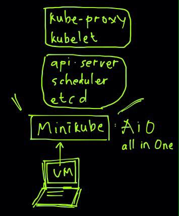

# CKA Exam Preparation

CKA = Certified Kubernetes Administrator</br>
Understand the CKA concept, prepare for the exam and practice, practice practices!

***

# Kubernetes Administration

**Disclaimer**: This is not likely a comprehensive list as the exam will be a moving target with the fast pace of k8s development - please make a pull request if there something wrong or that should be added, or updated in here.

Ensure you have the right version of Kubernetes documentation selected (e.g. v1.16 as of 20th Nov. 2019 exam) especially for API objects and annotations. This release removes several deprecated API's.  

## Exam Objectives

These are the exam objectives you review and understand in order to pass the test.

* [CNCF Exam Curriculum repository ](https://github.com/cncf/curriculum)


## [1. Core Concepts](https://kubernetes.io/docs/concepts/) 19%
<details> <summary> Details </summary>

* [Understand the Kubernetes API primitives](https://kubernetes.io/docs/reference/generated/kubernetes-api/v1.16/)
  * [concepts: Kubernetes Objects](https://kubernetes.io/docs/concepts/overview/working-with-objects/kubernetes-objects/)
  * youtube: [Kubernetes Webinar Series - Kubernetes Architecture 101](https://www.youtube.com/watch?v=zeS6OyDoy78)
* [Understand the Kubernetes cluster architecture](https://kubernetes.io/docs/concepts/overview/components/)
  * youtube: [A Technical Overview of Kubernetes (CoreOS Fest 2015) by Brendan Burns](https://www.youtube.com/watch?v=WwBdNXt6wO4)
* [Understand Services and other network primitives](https://kubernetes.io/docs/concepts/services-networking/service/)
  * youtube: [Life of a Packet [I] - Michael Rubin, Google](https://www.youtube.com/watch?v=0Omvgd7Hg1I)
  * youtube: [The ins and outs of networking in Google Container Engine and Kubernetes (Google Cloud Next '17)](https://www.youtube.com/watch?v=y2bhV81MfKQ)

* Architecture diagram


    **Master Node**
    - kube-apiserver: front-end of the cluster that services REST operations and connects to the etcd database
    - kube-scheduler: schedules Pods on specific nodes based on labels, taints, and tolerations set for the Pods
    - etcd: a B+tree key-value store that keeps the current cluster state
    - kube-controller-manager: manages current state of the cluster 
    - cloud-controller-manager: interacts with outside cloud managers 
    - Different optionals add-ons: 
        - DNS
        - Dashboard
        - Cluster level resource monitoring 
        - Cluster level logging 

    **Worker Node**
    - kubelet: passes requests to the container engine to ensure that Pods are available 
    - kube-proxy: runs on every node and uses iptables to provide an interface to connect to Kubernetes components
    - container runtime: takes care of actually running the containers 
    - supervisord: monitors and guarantee the availability of the kubelet and docker processes
    - network agent: implements software defined network solutions, such as weave
    - logging: the CNCF Project Fluentd is used for unified logging in the cluster. A Fluentd agent must be installed on the K8s nodes. 


*  Example Nginx deployment:
```yaml
apiVersion: apps/v1beta2 # for versions before 1.8.0 use apps/v1beta1
kind: Deployment
metadata:
  name: nginx-deployment
spec:
  replicas: 3
  selector:
    matchLabels:
      app: nginx
  template:
    metadata:
      labels:
        app: nginx
    spec:
      containers:
      - name: nginx
        image: nginx:1.7.9
        ports:
        - containerPort: 80
```

**Controlling API Access**
- API access is regulated by RBAC (Role Based Access Control)
- In RBAC, user accounts are identified as a set of certificates associated to name, defined in ~/.kube/conf (or /etc/kubernetes/admin.conf)
  ```bash
  current-context: kubernetes-admin@kubernetes
  kind: Config
  users:
  - name: kubernetes-admin
    user:
      client-certificate-data: LS0t....
      client-key-data: LS0t...
  ```
- Kubernetes distinguishes between the concept of a user account and a service account for a number of reasons:
  - User accounts are for humans. Service accounts are for processes, which run in pods.
  - User accounts are intended to be global and unique across all namespaces of a cluster. Service accounts are namespaced.
  - Typically, a cluster's User accounts might be synced from a corporate database, where new user account creation requires special privileges and is tied to complex business processes. Service account creation is intended to be more lightweight, allowing cluster users to create service accounts for specific tasks (i.e. principle of least privilege).
- Use kubectl auth can-i to verify what you can do with current credentials. 
  - kubectl auth can-i create deployments
  - kubectl auth can-i create pods --as linda
  - kubectl auth can-i create pods --as linda --namespaces apps

**Accessing the API**
- `kubectl api-resources` show API groups and resources within the APIs
- `kubectl api-versions`
- `kubectl explain`
- Kubectl auto-completion: `kubectl completion bash >> ~/.bashrc`. Relogin with user, and you should be able to do the kubectl auto-completion
- Or, you can make it available for all users by adding the below command: 
  ```bash
  kubectl completion bash >> /etc/bash_completion.d/kubectl
  ```

**Using `curl` to access the API**


- If the appropriate certificates are used, the API can be accessed by using **curl**
  - ```bash
    curl --cert myuser.pem --key myuser-key.pem --cacert /root/myca.pem https://controller:6443/api/v1
    ```
- **kubectl proxy** enable easy access to API without using certificates
  ```bash
  kubectl proxy --port 8001 &
  curl http://localhost:8001
  curl http://localhost:8001/api/v1/namespaces/default/pods
  kubectl get pods -n default -o json   # is giving the same result with the above command
  ```

**Understanding `etcdctl`**
- The `etcdctl` command can be used to interrogate and manage etcd database
- Different of versions exist: `etcdctl2` is to interract with v2 of API 
- `etcdctl` is version independent
- You need to install the package in advance: 
  ```bash
  yum install -y etcd
  ```
- Different version of etcd
  ```bash
  etcdctl --help  # This will give the default etcdctl version 2
  ETCDCTL_API=3 etcdctl --help  # This will give the etcdctl version 3
  ```


</details>


## [2. Installation, Configuration and Validation](https://github.com/kelseyhightower/kubernetes-the-hard-way/tree/f9486b081f8f54dd63a891463f0b0e783d084307) 12%
<details> <summary> Details </summary>

* Design a Kubernetes cluster
* [Install Kubernetes masters and nodes, including the use of TLS bootstrapping](https://kubernetes.io/docs/setup/production-environment/tools/kubeadm/install-kubeadm/)
* [Configure secure cluster communications](https://kubernetes.io/docs/tasks/tls/managing-tls-in-a-cluster/)
* [Configure a Highly-Available Kubernetes cluster](https://kubernetes.io/docs/admin/high-availability/)
* [Know where to get the Kubernetes release binaries](https://kubernetes.io/docs/getting-started-guides/binary_release/#prebuilt-binary-release)
* [Provision underlying infrastructure to deploy a Kubernetes cluster](https://github.com/kelseyhightower/kubernetes-the-hard-way/blob/f9486b081f8f54dd63a891463f0b0e783d084307/docs/01-infrastructure-gcp.md)
* [Choose a network solution](https://kubernetes.io/docs/concepts/cluster-administration/networking/)
* Choose your Kubernetes infrastructure configuration
* Run end-to-end tests on your cluster    
  * Some simple commands will cover most cases:
```
$ kubectl cluster-info
$ kubectl get nodes
$ kubectl get componentstatuses
$ kubectl get pods -o wide --show-labels --all-namespaces
$ kubectl get svc  -o wide --show-labels --all-namespaces
```

* Analyse end-to-end tests results.
* Install and use kubeadm to install, configure, and manage Kubernetes clusters.

* For more advanced end to end testing, which may not be covered on the exam, also see:
     * [End-To-End Testing in Kubernetes](https://github.com/kubernetes/community/blob/master/contributors/devel/sig-testing/e2e-tests.md)
     * [Using CNCF k8s conformance](https://github.com/cncf/k8s-conformance/blob/master/instructions.md)
     * [Heptio Sonobuoy Scanner](https://scanner.heptio.com/)

**Minikube architecture**
- Minikube is a minimum environment that manage to be functioned as Master and Worker node in single machine. 
- Minikube is good for CKAD practise, but a little difficult for CKA. 
- Architecture images: 



- **Kubernetes Cluster Installation**
    1. Cluster Node Requirement
        - To setup a Kubernetes on-premise cluster, **kubeadm** is used
        - On this Lab, we use 1 control node (master) and 2 worker node
        - Install the CentOS 7.x Minimal
        - Turn off swap space as required by kubelet to work (comment out swap on /etc/fstab and reboot the machine)
        - Disable the firewall or open appropriate port in the firewall
    2. **ON ALL NODES**
        - Lab environment: 
            - Master/Control Plane
                - 2 CPU (minimum requirement, otherwise `kubeadm init` will error)
                - 2 GB Memory
                - master.example.com
            - Worker
                - 1 GB Memory
                - worker1.example.com
                - worker2.example.com
        - Disable swap
        - Docker Runtime
            - Use docker-ce (community-edition)
        - Install base components
            ```bash
            yum install -y vim git bash-completion
            ```
        - Install some component with script
            ```bash
            git clone https://github.com/fahmifahim/kubernetes-cka.git
            cd kubernetes-cka/installation
            chmod u+x ./setup-docker.sh
            ./setup-docker.sh
            chmod u+x ./setup-kubetools.sh
            ./setup-kubetools.sh
            ```
        - Disabling firewall
        - Setting up kubernetes repo
        - Set SELinux in permisive mode
        - Install `kubelet` `kubeadm` `kubectl`
        - Setup hostname resolving on /etc/hosts

            <details><summary>setup-docker.sh and setup-kubetools.sh</summary>

            - setup-docker.sh

            ```bash
            #!/bin/bash
            # script that runs 
            # https://kubernetes.io/docs/setup/production-environment/container-runtime

            yum install -y vim yum-utils device-mapper-persistent-data lvm2
            yum-config-manager --add-repo https://download.docker.com/linux/centos/docker-ce.repo

            # notice that only verified versions of Docker may be installed
            # verify the documentation to check if a more recent version is available

            yum install -y docker-ce
            [ ! -d /etc/docker ] && mkdir /etc/docker

            cat > /etc/docker/daemon.json <<EOF
            {
            "exec-opts": ["native.cgroupdriver=systemd"],
            "log-driver": "json-file",
            "log-opts": {
                "max-size": "100m"
            },
            "storage-driver": "overlay2",
            "storage-opts": [
                "overlay2.override_kernel_check=true"
            ]
            }
            EOF

            cat >> /etc/hosts << EOF
            {
                192.168.11.14	master.example.com control master       # --> change this IP as your Lab environment
                192.168.11.15	worker1.example.com worker1             # --> change this IP as your Lab environment
                192.168.11.16	worker2.example.com worker2             # --> change this IP as your Lab environment
            }
            EOF

            mkdir -p /etc/systemd/system/docker.service.d

            systemctl daemon-reload
            systemctl restart docker
            systemctl enable docker

            systemctl disable --now firewalld
            ```

            - setup-kubetools.sh
            ```bash
            #!/bin/bash
            # kubeadm installation instructions as on
            # https://kubernetes.io/docs/setup/production-environment/tools/kubeadm/install-kubeadm/

            cat <<EOF > /etc/yum.repos.d/kubernetes.repo
            [kubernetes]
            name=Kubernetes
            baseurl=https://packages.cloud.google.com/yum/repos/kubernetes-el7-x86_64
            enabled=1
            gpgcheck=1
            repo_gpgcheck=1
            gpgkey=https://packages.cloud.google.com/yum/doc/yum-key.gpg https://packages.cloud.google.com/yum/doc/rpm-package-key.gpg
            EOF

            # Set SELinux in permissive mode (effectively disabling it)
            setenforce 0
            sed -i 's/^SELINUX=enforcing$/SELINUX=permissive/' /etc/selinux/config

            # disable swap (assuming that the name is /dev/centos/swap
            sed -i 's/^\/dev\/mapper\/centos-swap/#\/dev\/mapper\/centos-swap/' /etc/fstab
            swapoff /dev/mapper/centos-swap

            yum install -y kubelet kubeadm kubectl --disableexcludes=kubernetes

            systemctl enable --now kubelet

            # Set iptables bridging
            cat <<EOF >  /etc/sysctl.d/k8s.conf
            net.bridge.bridge-nf-call-ip6tables = 1
            net.bridge.bridge-nf-call-iptables = 1
            EOF
            sysctl --system
            ```

            </details>

    3. **ON MASTER/CONTROL PLANE**
        - `kubeadm init`

            <details><summary> kubeadm init (logs) </summary>
            
            ```bash
            kubeadm init
            W0506 16:48:54.526194    9665 configset.go:202] WARNING: kubeadm cannot validate component configs for API groups [kubelet.config.k8s.io kubeproxy.config.k8s.io]
            [init] Using Kubernetes version: v1.18.2
            [preflight] Running pre-flight checks
            [preflight] Pulling images required for setting up a Kubernetes cluster
            [preflight] This might take a minute or two, depending on the speed of your internet connection
            [preflight] You can also perform this action in beforehand using 'kubeadm config images pull'
            [kubelet-start] Writing kubelet environment file with flags to file "/var/lib/kubelet/kubeadm-flags.env"
            [kubelet-start] Writing kubelet configuration to file "/var/lib/kubelet/config.yaml"
            [kubelet-start] Starting the kubelet
            [certs] Using certificateDir folder "/etc/kubernetes/pki"
            [certs] Generating "ca" certificate and key
            [certs] Generating "apiserver" certificate and key
            [certs] apiserver serving cert is signed for DNS names [master.example.com kubernetes kubernetes.default kubernetes.default.svc kubernetes.default.svc.cluster.local] and IPs [10.96.0.1 192.168.11.14]
            [certs] Generating "apiserver-kubelet-client" certificate and key
            [certs] Generating "front-proxy-ca" certificate and key
            [certs] Generating "front-proxy-client" certificate and key
            [certs] Generating "etcd/ca" certificate and key
            [certs] Generating "etcd/server" certificate and key
            [certs] etcd/server serving cert is signed for DNS names [master.example.com localhost] and IPs [192.168.11.14 127.0.0.1 ::1]
            [certs] Generating "etcd/peer" certificate and key
            [certs] etcd/peer serving cert is signed for DNS names [master.example.com localhost] and IPs [192.168.11.14 127.0.0.1 ::1]
            [certs] Generating "etcd/healthcheck-client" certificate and key
            [certs] Generating "apiserver-etcd-client" certificate and key
            [certs] Generating "sa" key and public key
            [kubeconfig] Using kubeconfig folder "/etc/kubernetes"
            [kubeconfig] Writing "admin.conf" kubeconfig file
            [kubeconfig] Writing "kubelet.conf" kubeconfig file
            [kubeconfig] Writing "controller-manager.conf" kubeconfig file
            [kubeconfig] Writing "scheduler.conf" kubeconfig file
            [control-plane] Using manifest folder "/etc/kubernetes/manifests"
            [control-plane] Creating static Pod manifest for "kube-apiserver"
            [control-plane] Creating static Pod manifest for "kube-controller-manager"
            W0506 16:50:37.332345    9665 manifests.go:225] the default kube-apiserver authorization-mode is "Node,RBAC"; using "Node,RBAC"
            [control-plane] Creating static Pod manifest for "kube-scheduler"
            W0506 16:50:37.334387    9665 manifests.go:225] the default kube-apiserver authorization-mode is "Node,RBAC"; using "Node,RBAC"
            [etcd] Creating static Pod manifest for local etcd in "/etc/kubernetes/manifests"
            [wait-control-plane] Waiting for the kubelet to boot up the control plane as static Pods from directory "/etc/kubernetes/manifests". This can take up to 4m0s
            [apiclient] All control plane components are healthy after 35.529212 seconds
            [upload-config] Storing the configuration used in ConfigMap "kubeadm-config" in the "kube-system" Namespace
            [kubelet] Creating a ConfigMap "kubelet-config-1.18" in namespace kube-system with the configuration for the kubelets in the cluster
            [upload-certs] Skipping phase. Please see --upload-certs
            [mark-control-plane] Marking the node master.example.com as control-plane by adding the label "node-role.kubernetes.io/master=''"
            [mark-control-plane] Marking the node master.example.com as control-plane by adding the taints [node-role.kubernetes.io/master:NoSchedule]
            [bootstrap-token] Using token: 121svj.8urd4tdpt7r51p5n
            [bootstrap-token] Configuring bootstrap tokens, cluster-info ConfigMap, RBAC Roles
            [bootstrap-token] configured RBAC rules to allow Node Bootstrap tokens to get nodes
            [bootstrap-token] configured RBAC rules to allow Node Bootstrap tokens to post CSRs in order for nodes to get long term certificate credentials
            [bootstrap-token] configured RBAC rules to allow the csrapprover controller automatically approve CSRs from a Node Bootstrap Token
            [bootstrap-token] configured RBAC rules to allow certificate rotation for all node client certificates in the cluster
            [bootstrap-token] Creating the "cluster-info" ConfigMap in the "kube-public" namespace
            [kubelet-finalize] Updating "/etc/kubernetes/kubelet.conf" to point to a rotatable kubelet client certificate and key
            [addons] Applied essential addon: CoreDNS
            [addons] Applied essential addon: kube-proxy

            Your Kubernetes control-plane has initialized successfully!

            To start using your cluster, you need to run the following as a regular user:

            mkdir -p $HOME/.kube
            sudo cp -i /etc/kubernetes/admin.conf $HOME/.kube/config
            sudo chown $(id -u):$(id -g) $HOME/.kube/config

            You should now deploy a pod network to the cluster.
            Run "kubectl apply -f [podnetwork].yaml" with one of the options listed at:
            https://kubernetes.io/docs/concepts/cluster-administration/addons/

            Then you can join any number of worker nodes by running the following on each as root:

            kubeadm join 192.168.11.14:6443 --token 121svj.8urd4tdpt7r51p5n \
                --discovery-token-ca-cert-hash sha256:996d622a652b5ae512c1df35bf1560c252f0f70af8efee1a893849e5a7155231

            ```
            
            </details>

        - **Take a note of the `kubeadm join`** for the Token created

    4. **STARTING THE CLUSTER**
        - Create the client configuration as a regular user account
            ```bash
            su student
            mkdir -p $HOME/.kube
            sudo cp -l /etc/kubernetes/admin.conf $HOME/.kube/config
            sudo chown $(id -u):$(id -g) $HOME/.kube/config

            # Check the config file
            ls -l $HOME/.kube/config
               -rw-------. 1 student student 5453 May  6 17:00 config
            cat $HOME/.kube/config

            # (Optional) Your root user may also copy the config file to its directory
            sudo su -
            mkdir -p $HOME/.kube
            cp -l /etc/kubernetes/admin.conf $HOME/.kube/config
                --> Now your root user can call the kubectl command too
            ```
        - Verify by `kubectl cluster-info`
            ```bash
            $ kubectl cluster-info
            Kubernetes master is running at https://192.168.11.14:6443
            KubeDNS is running at https://192.168.11.14:6443/api/v1/namespaces/kube-system/services/kube-dns:dns/proxy

            To further debug and diagnose cluster problems, use 'kubectl cluster-info dump'.
            ```
        - `kubectl get nodes` (will give you not ready status at this point. it is normal)
            ```bash
            $ kubectl get nodes
            NAME                 STATUS     ROLES    AGE   VERSION
            master.example.com   NotReady   master   16m   v1.18.2
            ```
    5. **[Installing a Pod Network Add-on](https://kubernetes.io/docs/setup/production-environment/tools/kubeadm/create-cluster-kubeadm/#pod-network)**
        - A Network Add-on must be installed for pods to communicate
        - CNI (Container Network Interface) which work with add-ons to implement networking
        - Look for an add-on that supports `network-policy` as well as RBAC
        - Common pod network plugin: 
            - Weave: a common ad-on for a CNI-enabled Kubernetes cluster
            - Flannel: a layer 3 IPV4 network between cluster nodes that can use several backend mechanism such as VXLAN
            - Calico: a layer 3 network solution that uses IP encapsulation and is used in Kubernetes, OpenStack, OpenShift, Docker, etc
            - AWS VPC: network plugin commonly used for AWS environment
        - Network plugin is installed from control plane (master node)
        - In our lab, we apply the Weave plugin: 
            ```bash
            # Install the network plugin from Master node
            $ kubectl apply -f "https://cloud.weave.works/k8s/net?k8s-version=$(kubectl version | base64 | tr -d '\n')"
                serviceaccount/weave-net created
                clusterrole.rbac.authorization.k8s.io/weave-net created
                clusterrolebinding.rbac.authorization.k8s.io/weave-net created
                role.rbac.authorization.k8s.io/weave-net created
                rolebinding.rbac.authorization.k8s.io/weave-net created
                daemonset.apps/weave-net created    

            $ kubectl get pods --all-namespaces
                NAMESPACE     NAME                                         READY   STATUS    RESTARTS   AGE
                kube-system   coredns-66bff467f8-2vqrg                     1/1     Running   0          31m
                kube-system   coredns-66bff467f8-fnq7h                     1/1     Running   0          31m
                kube-system   etcd-master.example.com                      1/1     Running   0          31m
                kube-system   kube-apiserver-master.example.com            1/1     Running   0          31m
                kube-system   kube-controller-manager-master.example.com   1/1     Running   0          31m
                kube-system   kube-proxy-tbdzc                             1/1     Running   0          31m
                kube-system   kube-scheduler-master.example.com            1/1     Running   0          31m
                kube-system   weave-net-tp5b9                              2/2     Running   0          72s

            ! Make sure all the above pods are "Running" before you move forward to join the worker node to the cluster

            $ kubectl get nodes
                NAME                 STATUS   ROLES    AGE   VERSION
                master.example.com   Ready    master   33m   v1.18.2

            $ exit 

            ```
    6. **JOINING WORKER NODE**
        - Use the command from `kubeadm join` as we noted on the previous procedure
            ```bash
            kubeadm join 192.168.11.14:6443 --token 121svj.8urd4tdpt7r51p5n \
                --discovery-token-ca-cert-hash sha256:996d622a652b5ae512c1df35bf1560c252f0f70af8efee1a893849e5a7155231
            ```
        - Execute the `kubeadm join ...` at each worker nodes
            ```bash
            ssh worker1
                root@worker1's password:
                Last login: Wed May  6 17:30:47 2020 from master.example.com
            
            # Copy paste the kubeadm join
            kubeadm join 192.168.11.14:6443 --token 121svj.8urd4tdpt7r51p5n \
                --discovery-token-ca-cert-hash sha256:996d622a652b5ae512c1df35bf1560c252f0f70af8efee1a893849e5a7155231

            # Result: 
                W0506 17:32:39.026771    5170 join.go:346] [preflight] WARNING: JoinControlPane.controlPlane settings will be ignored when control-plane flag is not set.
                [preflight] Running pre-flight checks
                [preflight] Reading configuration from the cluster...
                [preflight] FYI: You can look at this config file with 'kubectl -n kube-system get cm kubeadm-config -oyaml'
                [kubelet-start] Downloading configuration for the kubelet from the "kubelet-config-1.18" ConfigMap in the kube-system namespace
                [kubelet-start] Writing kubelet configuration to file "/var/lib/kubelet/config.yaml"
                [kubelet-start] Writing kubelet environment file with flags to file "/var/lib/kubelet/kubeadm-flags.env"
                [kubelet-start] Starting the kubelet
                [kubelet-start] Waiting for the kubelet to perform the TLS Bootstrap...

                This node has joined the cluster:
                * Certificate signing request was sent to apiserver and a response was received.
                * The Kubelet was informed of the new secure connection details.

                Run 'kubectl get nodes' on the control-plane to see this node join the cluster.
            ```

            ```bash
            [student@master root]$ kubectl get nodes
                NAME                  STATUS   ROLES    AGE     VERSION
                master.example.com    Ready    master   51m     v1.18.2
                worker1.example.com   Ready    <none>   9m37s   v1.18.2
                worker2.example.com   Ready    <none>   77s     v1.18.2
            ```
    7. Check the `kubectl config view`
        ```bash
        $ kubectl config view
            apiVersion: v1
            clusters:
            - cluster:
                certificate-authority-data: DATA+OMITTED
                server: https://192.168.11.14:6443
            name: kubernetes
            contexts:
            - context:
                cluster: kubernetes
                user: kubernetes-admin
            name: kubernetes-admin@kubernetes
            current-context: kubernetes-admin@kubernetes
            kind: Config
            preferences: {}
            users:
            - name: kubernetes-admin
            user:
                client-certificate-data: REDACTED
                client-key-data: REDACTED    
        ```

</details>

## 3. Security 12%
<details> <summary> Details </summary>

* [Securing a kubernetes cluster](https://kubernetes.io/docs/tasks/administer-cluster/securing-a-cluster/)
    * youtube: [Building for Trust: How to Secure Your Kubernetes Cluster [I] - Alexander Mohr & Jess Frazelle](https://www.youtube.com/watch?v=YRR-kZub0cA)
* [Know how to configure authentication and authorization](https://kubernetes.io/docs/admin/authorization/rbac/)
  * [Access the api](https://kubernetes.io/docs/admin/accessing-the-api/)
  * [Authentication](https://kubernetes.io/docs/reference/access-authn-authz/authentication/)
  * [Authorization with RBAC](https://kubernetes.io/docs/admin/authorization/rbac/)
  * [Admission Control](https://kubernetes.io/docs/admin/admission-controllers/)
* [Understand Kubernetes security primitives]
  * [Pod Security Policy](https://kubernetes.io/docs/concepts/policy/pod-security-policy/)
    * [PSP and RBAC](https://github.com/kubernetes/examples/blob/master/staging/podsecuritypolicy/rbac/README.md)
* [Know to configure network policies](https://kubernetes.io/docs/tasks/administer-cluster/declare-network-policy/)
  * [Blog: Kubernetes network policy](https://ahmet.im/blog/kubernetes-network-policy/)
  * [Katacoda Calico](https://www.katacoda.com/projectcalico/scenarios/calico)
* [Create and manage TLS certificates for cluster components](https://kubernetes.io/docs/tasks/tls/managing-tls-in-a-cluster/)
* Work with images securely
* [Define security contexts](https://kubernetes.io/docs/tasks/configure-pod-container/security-context/)
* [Secure persistent key value store](https://kubernetes.io/docs/concepts/configuration/secret/)

</details>

## [4. Networking](https://kubernetes.io/docs/concepts/cluster-administration/networking/) 11%
<details> <summary> Details </summary>

* [Understand the networking configuration on the cluster nodes](https://kubernetes.io/docs/concepts/cluster-administration/networking/)
* Understand Pod networking concepts
  * youtube: [The ins and outs of networking in Google Container Engine and Kubernetes (Google Cloud Next '17)](https://www.youtube.com/watch?v=y2bhV81MfKQ)
  * youtube: [Networking with Kubernetes](https://www.youtube.com/watch?v=WwQ62OyCNz4)
  * [Illustrated Guide To Kubernetes Networking by Tim Hockin](https://speakerdeck.com/thockin/illustrated-guide-to-kubernetes-networking)
* Understand service networking
  * youtube: [Life of a Packet [I] - Michael Rubin, Google](https://www.youtube.com/watch?v=0Omvgd7Hg1I)
* [Deploy and configure network load balancer](https://kubernetes.io/docs/tasks/access-application-cluster/create-external-load-balancer/)
* [Know how to use Ingress rules](https://kubernetes.io/docs/concepts/services-networking/ingress/)
* [Know how to configure and use the cluster DNS](https://kubernetes.io/docs/concepts/services-networking/dns-pod-service/)
* [Understand CNI](https://github.com/containernetworking/cni)
  * [More information on CNI](http://www.dasblinkenlichten.com/understanding-cni-container-networking-interface/)

</details>

## 5. Cluster Maintenance 11%
<details> <summary> Details </summary>

* [Understand Kubernetes cluster upgrade process](https://kubernetes.io/docs/getting-started-guides/ubuntu/upgrades/)
    * Best resource upgrade is to watch [TGI Kubernetes 011: Upgrading to 1.8 with kubeadm](https://youtu.be/x9doB5eJWgQ)
* [Facilitate operating system upgrades](https://cloud.google.com/container-engine/docs/clusters/upgrade) #need review to make it more platform agnostic
* [Implement backup and restore methodologies](https://kubernetes.io/docs/getting-started-guides/ubuntu/backups/)
* Other: 
    * [Etcd management/backups/restore](https://kubernetes.io/docs/tasks/administer-cluster/configure-upgrade-etcd)

</details>

## [6. Troubleshooting](https://kubernetes.io/docs/tasks/debug-application-cluster/troubleshooting/) 10%
<details> <summary> Details </summary>

* [Troubleshoot application failure](https://kubernetes.io/docs/tasks/debug-application-cluster/determine-reason-pod-failure/)
  * [Application Introspection and Debugging](https://kubernetes.io/docs/tasks/debug-application-cluster/debug-application-introspection/)
  * [Services](https://kubernetes.io/docs/tasks/debug-application-cluster/debug-service/)
* [Troubleshoot control plane failure](https://kubernetes.io/docs/tasks/debug-application-cluster/debug-cluster/)
  * youtube [Kubernetes Day 2: Cluster Operations [I] - Brandon Philips, CoreOS](https://www.youtube.com/watch?v=U1zR0eDQRYQ)
  * Safaribooksonline: [https://www.safaribooksonline.com/library/view/oscon-2016-video/9781491965153/video246982.html](https://www.safaribooksonline.com/library/view/oscon-2016-video/9781491965153/video246982.html)
* [Troubleshoot worker node failure](https://kubernetes.io/docs/tasks/debug-application-cluster/debug-cluster/)
* Troubleshoot networking

</details>

## [7. Storage](https://kubernetes.io/docs/concepts/storage/volumes/) 7%
< details > <summary> Details </summary>


* [Understand persistent volumes and know how to create them](https://kubernetes.io/docs/concepts/storage/persistent-volumes/)
* [Understand access modes for volumes](https://kubernetes.io/docs/concepts/storage/persistent-volumes/#access-modes)
* [Understand persistent volume claims primitive](https://kubernetes.io/docs/concepts/storage/persistent-volumes/#persistentvolumeclaims)
* [Understand Kubernetes storage objects](https://kubernetes.io/docs/concepts/storage/volumes/#types-of-volumes)
* [Know how to configure applications with persistent storage](https://kubernetes.io/docs/tasks/configure-pod-container/configure-volume-storage/)

- PV and PVC diagram

  - Pods only care about PVC. Pod doesn't care about PV. 
  - Multiple pods can bind to a single PVC. So that multiple pods can write data to the same PV. 
  - PVC and PV bound by the same `accessMode`. PVC search the same `accessMode` on PV. 
  - PV can't be mounted by multiple PVCs. PV can be bounded by only one PVC. 1 vs 1. 
  - PVC bounded PV randomly (? need further labs check)
  - PVC will be `pending` if it doesn't find correlate PV. 


</details>

## 8. Application Lifecycle Management 8%
<details> <summary> Details </summary>

* [Understand Deployments and how to perform rolling updates and rollbacks](https://kubernetes.io/docs/concepts/workloads/controllers/deployment/)
* [Know various ways to configure applications](https://kubernetes.io/docs/concepts/cluster-administration/manage-deployment/)
* [Know how to scale applications](https://kubernetes.io/docs/concepts/cluster-administration/manage-deployment/#scaling-your-application)
* Understand the primitives necessary to create a self-healing application

**Undestanding Namespaces**
- Namespace are a Linux kernel feature that is leveraged up to Kubernetes level
- Namespace implement strict resource separation
- Use namespaces to separate different customer environments within one Kubernetes cluster
- Four namespaces which are defined when a cluster is created: 
  - default: this is where all Kubernetes resources are created by default
  - kube-node-lease: an administrative namespace where node lease information is stored
  - kube-public: a namespace is world-readable
  - kube-system: contains all infrastructure pods
```bash
$ kubectl get ns 
    NAME              STATUS   AGE
    default           Active   8d
    kube-node-lease   Active   8d
    kube-public       Active   8d
    kube-system       Active   8d

$ kubectl get all --all-namespaces
    NAMESPACE     NAME                                                READY   STATUS    RESTARTS   AGE
    kube-system   pod/coredns-66bff467f8-5jzx2                        1/1     Running   4          8d
    kube-system   pod/coredns-66bff467f8-v6lct                        1/1     Running   4          8d
    kube-system   pod/etcd-vb-master.example.com                      1/1     Running   7          8d
    kube-system   pod/kube-apiserver-vb-master.example.com            1/1     Running   14         8d
    kube-system   pod/kube-controller-manager-vb-master.example.com   1/1     Running   12         8d
    kube-system   pod/kube-proxy-bvqs8                                1/1     Running   5          8d
    kube-system   pod/kube-proxy-hxpjt                                1/1     Running   3          8d
    kube-system   pod/kube-scheduler-vb-master.example.com            1/1     Running   12         8d
    kube-system   pod/weave-net-cc498                                 2/2     Running   18         8d
    kube-system   pod/weave-net-x86h6                                 2/2     Running   10         8d

    NAMESPACE     NAME                 TYPE        CLUSTER-IP   EXTERNAL-IP   PORT(S)                  AGE
    default       service/kubernetes   ClusterIP   10.96.0.1    <none>        443/TCP                  8d
    kube-system   service/kube-dns     ClusterIP   10.96.0.10   <none>        53/UDP,53/TCP,9153/TCP   8d

    NAMESPACE     NAME                        DESIRED   CURRENT   READY   UP-TO-DATE   AVAILABLE   NODE SELECTOR            AGE
    kube-system   daemonset.apps/kube-proxy   2         2         2       2            2           kubernetes.io/os=linux   8d
    kube-system   daemonset.apps/weave-net    2         2         2       2            2           <none>                   8d

    NAMESPACE     NAME                      READY   UP-TO-DATE   AVAILABLE   AGE
    kube-system   deployment.apps/coredns   2/2     2            2           8d

    NAMESPACE     NAME                                 DESIRED   CURRENT   READY   AGE
    kube-system   replicaset.apps/coredns-66bff467f8   2         2         2       8d

$ kubectl create ns dev
    namespace/dev created

$ kubectl describe ns dev
    Name:         dev
    Labels:       <none>
    Annotations:  <none>
    Status:       Active

    No resource quota.

    No LimitRange resource.

$ kubectl get ns dev
    NAME   STATUS   AGE
    dev    Active   36s

$ kubectl get ns dev -o yaml
    apiVersion: v1
    kind: Namespace
    metadata:
      creationTimestamp: "2020-05-16T12:24:35Z"
      managedFields:
      - apiVersion: v1
        fieldsType: FieldsV1
        fieldsV1:
          f:status:
            f:phase: {}
        manager: kubectl
        operation: Update
        time: "2020-05-16T12:24:35Z"
      name: dev
      resourceVersion: "938534"
      selfLink: /api/v1/namespaces/dev
      uid: 5f859fb3-7ec8-4310-af2c-cd08e40921ce
    spec:
      finalizers:
      - kubernetes
    status:
      phase: Active

```

**Create Deployment**
```bash
$ kubectl create deployment newnginx --image=nginx -n dev 

$ kubectl get deployment -n dev --show-labels

$ kubectl get all
    NAME                            READY   STATUS    RESTARTS   AGE
    pod/newnginx-5f6bd64bcc-95gp5   1/1     Running   0          36s

    NAME                       READY   UP-TO-DATE   AVAILABLE   AGE
    deployment.apps/newnginx   1/1     1            1           36s

    NAME                                  DESIRED   CURRENT   READY   AGE
    replicaset.apps/newnginx-5f6bd64bcc   1         1         1       36s
```

**Scale Deployment**
```bash
$ kubectl scale deployment newnginx -n dev --replicas=3
$ kubectl edit deployment newnnginx -n dev
```

**Deploy App Without Downtime**
- Strategy to upgrade App (eg:change App Image) using the `maxSurge` and `maxUnavailable`, to make sure old app and new app are deployed accordingly without affecting the down of your application. 
- **maxSurge**
  - `maxSurge` specifies the maximum number of Pods that can be created over the desired number of Pods. The value can be an absolute number (for example, 5) or a percentage of desired Pods (for example, 10%). 
  - For example, when this value is set to 30%, the new ReplicaSet can be scaled up immediately when the rolling update starts, such that the total number of old and new Pods does not exceed 130% of desired Pods. Once old Pods have been killed, the new ReplicaSet can be scaled up further, ensuring that the total number of Pods running at any time during the update is at most 130% of desired Pods.
- **maxUnavailable**
  - `maxUnavailable` specifies the maximum number of Pods that can be unavailable during the update process. The value can be an absolute number (for example, 5) or a percentage of desired Pods (for example, 10%). 
  - For example, when this value is set to 30%, the old ReplicaSet can be scaled down to 70% of desired Pods immediately when the rolling update starts. Once new Pods are ready, old ReplicaSet can be scaled down further, followed by scaling up the new ReplicaSet, ensuring that the total number of Pods available at all times during the update is at least 70% of the desired Pods.


#### Rolling Update Deployment 
- `kubectl rollout history deployment`
  ```bash
  $ kubectl rollout history deployment rolling-nginx
      deployment.apps/rolling-nginx
      REVISION  CHANGE-CAUSE
      1         <none>
      2         <none>
      3         <none>
  ```
- `kubectl rollout status deployment <deployment-name>`
  ```bash
  $ kubectl rollout status deployment rolling-nginx
      deployment "rolling-nginx" successfully rolled out
  ```
- `kubectl rollout history deployment rolling-nginx --revision 9`
  ```bash
  $ kubectl rollout history deployment rolling-nginx --revision 9
      deployment.apps/rolling-nginx with revision #9
      Pod Template:
        Labels:	app=nginx
        pod-template-hash=567df7d6d9
        Containers:
        nginx:
          Image:	nginx:1.16
          Port:	<none>
          Host Port:	<none>
          Environment:	<none>
          Mounts:	<none>
        Volumes:	<none>
  ```  
- `kubectl rollout undo deployment <deployment-name>`

</details>

## 9. Scheduling 5%
<details> <summary> Details </summary>

* [Use label selectors to schedule Pods](https://kubernetes.io/docs/concepts/overview/working-with-objects/labels/)
* [Understand the role of DaemonSets](https://kubernetes.io/docs/concepts/workloads/controllers/daemonset/)
* [Understand how resource limits can affect Pod scheduling](https://kubernetes.io/docs/tasks/administer-cluster/memory-default-namespace/)
* [Understand how to run multiple schedulers and how to configure Pods to use them](https://kubernetes.io/docs/tasks/administer-cluster/configure-multiple-schedulers/)
* [Manually schedule a pod without a scheduler](https://kubernetes.io/docs/tasks/administer-cluster/static-pod/)
   If you require a pod to start on a specific node, you can specify this in POD spec.nodeName, that is what DaemonSets do.
* [Display scheduler events](https://stackoverflow.com/questions/28857993/how-does-kubernetes-scheduler-work/28874577#28874577)
  /var/log/kube-scheduler.log on the control/master node
  or use `kubectl describe` as in
```
  $kubectl describe pods <POD NAME UNDER Investigation>  | grep -A7 ^Events
```
* [Know how to configure the Kubernetes scheduler](https://kubernetes.io/docs/tasks/administer-cluster/configure-multiple-schedulers/)

</details>

## [10. Logging/Monitoring](https://kubernetes.io/docs/concepts/cluster-administration/logging/) 5%
<details> <summary> Details </summary>

* [Understand how to monitor all cluster components](https://kubernetes.io/docs/tasks/debug-application-cluster/resource-usage-monitoring/)
* Understand how to monitor applications
* [Manage cluster component logs](https://kubernetes.io/docs/tasks/debug-application-cluster/debug-cluster/#looking-at-logs)
  * Master
    * /var/log/kube-apiserver.log - API Server, responsible for serving the API
    * /var/log/kube-scheduler.log - Scheduler, responsible for making scheduling decisions
    * /var/log/kube-controller-manager.log - Controller that manages replication controllers
  * Worker Nodes
    * /var/log/kubelet.log - Kubelet, responsible for running containers on the node
    * /var/log/kube-proxy.log - Kube Proxy, responsible for service load balancing
* [Manage application logs](https://kubernetes.io/docs/reference/generated/kubectl/kubectl-commands#logs)
* Other: 
    * [Pod and Node metrics](https://kubernetes.io/docs/reference/kubectl/cheatsheet/#interacting-with-running-pods)
    * [Monitoring Kubernetes](https://www.datadoghq.com/blog/monitoring-kubernetes-era/)

</details>

***

## Practice Exam
* [CKA Practice Exam Environment](https://github.com/arush-sal/cka-practice-environment)

## Train Yourself Now (Exam Practices)
#### Using **curl** to Explore the API
- Use `curl` to explore which Pods are present in the kube-system namespace
<details><summary>Answer</summary>

```bash
kubectl proxy --port 8080 & 
curl http://localhost:8080/api/v1/namespaces/kube-system/pods
```

</details>

#### Managing Deployments
- Run a deployment that starts one nginx web server Pod on all cluster nodes
<details><summary>Answer</summary>

##### This question is related to Daemonsets. Go to the documentation and find sample yaml for Daemonset!

Sample yaml for Daemonset
```bash
$ vi nginx-daemonset.yaml
```
```yaml
apiVersion: apps/v1
kind: DaemonSet
metadata:
  name: nginx-ds
  labels:
    k8s-app: nginx-lable
spec:
  selector:
    matchLabels:
      name: nginx-ds
  template:
    metadata:
      labels:
        name: nginx-ds
    spec:
      containers:
      - name: nginx-ds
        image: nginx
```

```bash
$ kubectl create -f nginx-daemonset.yaml
    daemonset.apps/nginx-ds created

$ kubectl get pod -o wide 
    NAME             READY   STATUS    RESTARTS   AGE   IP          NODE                     NOMINATED NODE   READINESS GATES
    nginx-ds-2bjhg   1/1     Running   0          28s   10.44.0.1   vb-worker1.example.com   <none>           <none>
```

- alternative answer: 
```bash
# List your nodes
$ kubectl get nodes --show-labels
    NAME                     STATUS   ROLES    AGE   VERSION   LABELS
    vb-master.example.com    Ready    master   8d    v1.18.2   beta.kubernetes.io/arch=amd64,beta.kubernetes.io/os=linux,kubernetes.io/arch=amd64,kubernetes.io/hostname=vb-master.example.com,kubernetes.io/os=linux,node-role.kubernetes.io/master=
    vb-worker1.example.com   Ready    <none>   8d    v1.18.2   beta.kubernetes.io/arch=amd64,beta.kubernetes.io/os=linux,kubernetes.io/arch=amd64,kubernetes.io/hostname=vb-worker1.example.com,kubernetes.io/os=linux

# Add specific label to nodes so that App will be deployed there
$ kubectl label nodes <node-name> node-app=nginx

# Create yaml manually for deployment
$ kubectl create deployment test-nginx --image nginx --dry-run -o yaml > test-nginx.yaml

# edit the yaml and set the nodeselector
$ vi test-nginx.yaml
    apiVersion: apps/v1
    kind: Deployment
    metadata:
      creationTimestamp: null
      labels:
        app: test-nginx
      name: test-nginx
    spec:
      replicas: 1
      selector:
        matchLabels:
          app: test-nginx
      strategy: {}
      template:
        metadata:
          creationTimestamp: null
          labels:
            app: test-nginx
        spec:
          containers:
          - image: nginx
            name: nginx
            resources: {}
          nodeSelector:           # --> add this
            node-app: nginx       # --> add this
    status: {}

# Create deployment with yaml
$ kubectl create -f test-nginx.yaml

# Make sure apps run on Worker nodes
$ kubectl get pod -owide


```

</details>


#### QuestionTopic
- Question Details
<details><summary>Answer</summary>

```bash

```

</details>


## Tips:

Get familiar with:
* [kubectl explain](https://blog.heptio.com/kubectl-explain-heptioprotip-ee883992a243)
* [kubectl cheatsheet](https://kubernetes.io/docs/user-guide/kubectl-cheatsheet/)
* How to switch namespaces in Kubernetes?
```bash
kubectl config set-context --current --namespace=<namespace>
```
```bash
$ kubectl config current-contexts # check your current context 
$ kubectl config set-context <context-of-question> --namespace=<namespace-of-question>
$ kubectl config current-context 
$ kubectl config view 
$ kubectl config view | grep namespace
```
* When using kubectl for investigations and troubleshooting utilize the wide output it gives your more details
```
     $kubectl get pods -o wide --show-labels --all-namespaces
```
* In `kubectl` utilizie `--all-namespaces` to ensure deployments, pods, objects are on the right name space, and right desired state

* for events and troubleshooting utilize kubectl describe
```
     $kubectl describe pods <PODID>
```
* the '-o yaml' in conjuction with `--dry-run` allows you to create a manifest template from an imperative spec, combined with `--edit` it allows you to modify the object before creation
```
kubectl create service clusterip my-svc -o yaml --dry-run > /tmp/srv.yaml
kubectl create --edit -f /tmp/srv.yaml
```
## Do you want more?

- [Kubernauts resources list](https://docs.google.com/spreadsheets/d/10NltoF_6y3mBwUzQ4bcQLQfCE1BWSgUDcJXy-Qp2JEU/edit#gid=0)

#### Lab environment
```bash
#terapod
192.168.11.14	master.example.com
192.168.11.15	worker1.example.com
192.168.11.16	worker2.example.com


192 /et.168.11.5    putihfj
192.168.11.19   putihfj-back
192.168.11.25   vb-master.example.com
192.168.11.26   vb-worker1.example.com


#Command to turn on virtual machine by command
/usr/lib/vmware/bin/vmplayer /root/vmware/kb-worker1/kb-worker1.vmx
https://docs.vmware.com/en/VMware-Workstation-Player-for-Linux/15.0/com.vmware.player.linux.using.doc/GUID-BF62D91D-0647-45EA-9448-83D14DC28A1C.html

#But, I would recommend you Virtual Box ^^;

```
