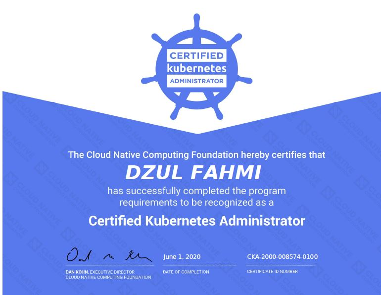

# kubernetes-cka
Repository for kubernetes (CKA exam preparation)

- Jump to [this page](https://github.com/fahmifahim/kubernetes-cka/blob/master/01.CKA_exam_concepts_practices.md) for the CKA-exam preparation repository
- If you are planning to take the CKAD, visit my [CKAD repository here](https://github.com/fahmifahim/kubernetes-ckad/blob/master/01.CKAD_exam_concepts_practices.md)!

### Materials are compiled from various sources 
- [Kubernetes the hard way Github repo](https://github.com/kelseyhightower/kubernetes-the-hard-way)
- [The Ultimate Guide to Passing the CKA Exam](https://www.contino.io/insights/the-ultimate-guide-to-passing-the-cka-exam)
- [Walid Shaari’s GitHub repo Kubernetes-Certified-Administrator](https://github.com/walidshaari/Kubernetes-Certified-Administrator)
- [Practice Examples, Dumps & Tips ? CKA & CKAD (Certified Kubernetes Administrator and Developer) Exam by CNCF](https://medium.com/@sensri108/practice-examples-dumps-tips-for-cka-ckad-certified-kubernetes-administrator-exam-by-cncf-4826233ccc27)
- [Kubernetes CKA Example Exam Questions Practical Challenge](https://levelup.gitconnected.com/kubernetes-cka-example-questions-practical-challenge-86318d85b4d)
- [Certified Kubernetes Administrator (CKA) 受験ログ](https://qiita.com/sotoiwa/items/3509ca3d18d1bed00dee)
- [CKA/CKADに合格したので比較してみた + Tips](https://qiita.com/oke-py/items/e8bf3863c8f48d750427)

### Practice Hard and Celebrate Your Works!

